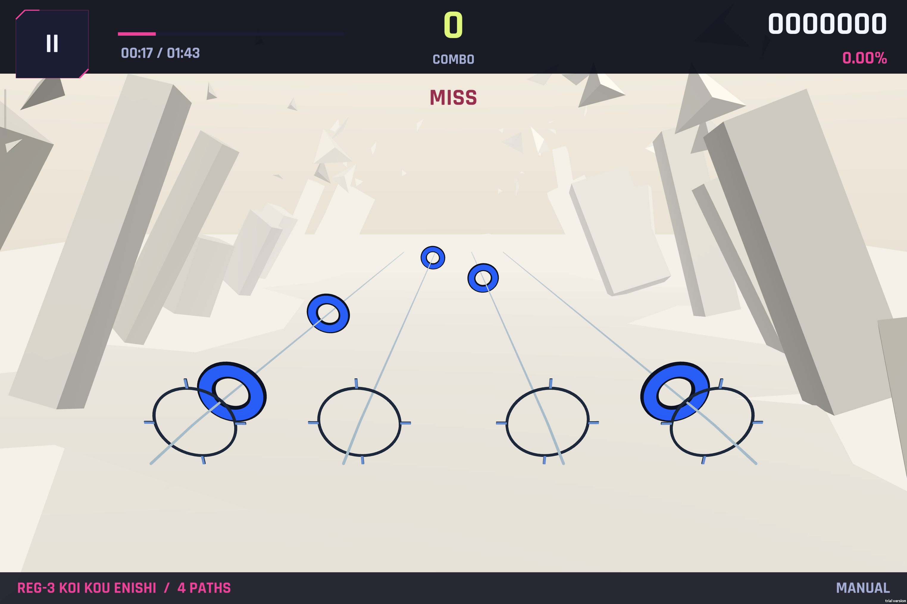
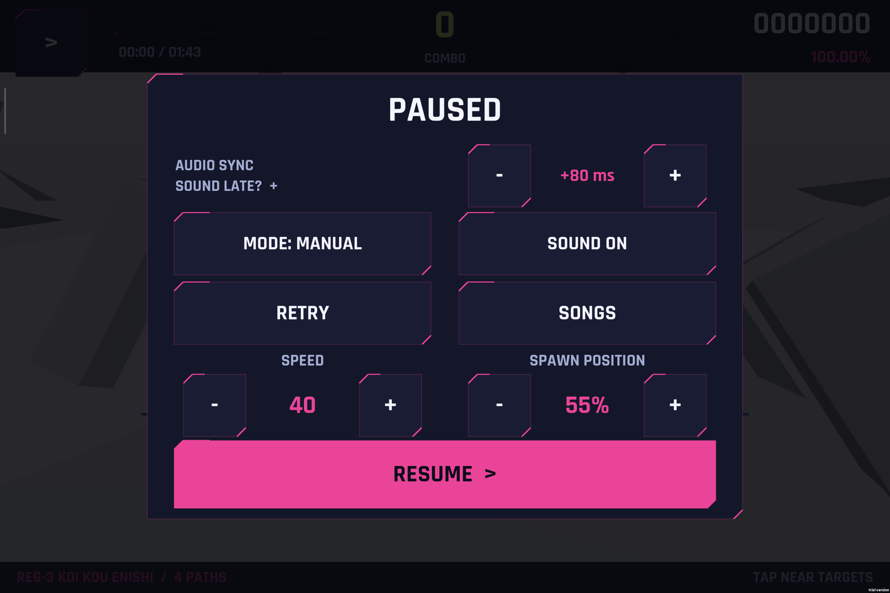

# 安卓平板真机调试

本页记录第一次把 Demo 装到真机平板上跑的流程、命令和真机暴露的问题。

## 设备与构建

| 项 | 值 |
| --- | --- |
| 设备 | Xiaomi Pad（型号 24018RPACC），Android 16 / API 36 |
| ABI | arm64-v8a（arm64-v8a,armeabi-v7a,armeabi） |
| 屏幕 | 物理 2032×3048 @400dpi，横屏 3048×2032（3:2），刷新率 120 / 144 Hz 可切换 |
| 内存页 | 4096 字节（不是 16 KB 页设备） |
| 包名 | `com.geometryrhythm.demo` |
| 产物 | `Builds/Android/GeometryRhythmDemo.apk`（约 47 MB） |

构建入口是 `GeometryRhythm.Editor.DemoBuildTools.BuildAndroid`：横屏两个方向（竖屏关闭）、
**ARM64 + IL2CPP**、`minSdk 24`、`targetSdk` 取本机 SDK 最高（当前 35）、**Development 播放器**
（完整堆栈、可挂 profiler）。构建同样在 `.validation` 隔离副本里执行，不打断正在使用的主编辑器：

```powershell
& "C:\Program Files\Unity\Hub\Editor\2022.3.62f3c1\Editor\Unity.exe" `
  -batchmode -nographics -projectPath "$PWD\.validation" `
  -executeMethod GeometryRhythm.Editor.DemoBuildTools.BuildAndroid `
  -androidBuildDirectory Builds/Android -quit -logFile Logs/android-build.log
```

Unity 自带 Android SDK / NDK / OpenJDK 与 adb，无需另装：

```powershell
$adb = "C:\Program Files\Unity\Hub\Editor\2022.3.62f3c1\Editor\Data\PlaybackEngines\AndroidPlayer\SDK\platform-tools\adb.exe"
```

## 装到设备并调试

```powershell
& $adb devices -l                                   # 授权过的设备列表
& $adb shell svc power stayon true                  # 插着 USB 时不息屏
& $adb install -r Builds\Android\GeometryRhythmDemo.apk
& $adb logcat -c
& $adb shell am start -n com.geometryrhythm.demo/com.unity3d.player.UnityPlayerActivity
& $adb shell pidof -s com.geometryrhythm.demo       # 进程号，用来过滤日志
& $adb logcat -d -v time > Logs\android\logcat.txt  # 抓日志
& $adb shell screencap -p /sdcard/shot.png; & $adb pull /sdcard/shot.png .\shot.png
```

小米 / HyperOS 注意事项：

- 通过 adb 安装会弹一次系统确认框；**误点拒绝**会直接返回
  `INSTALL_FAILED_USER_RESTRICTED: Install canceled by user`，重新执行 `adb install -r` 即可。
  `adb shell settings put global adb_install_need_confirm 0` 可以免掉后续每次都确认。
- 平板息屏或锁屏时安装同样会被系统取消（对话框无法显示）；先 `adb shell input keyevent KEYCODE_WAKEUP`，
  必要时在平板上解锁。
- `adb shell input tap/swipe` 需要开发者选项里的「USB 调试（安全设置）」才能注入触摸。

## 真机暴露并已修复的问题

**`MeshCollider` 被剥离。** 首次真机运行日志出现：

```text
E/Unity: Can't add component because class 'MeshCollider' doesn't exist!
  at GeometryRhythm.AuthoredVisualDirector:.ctor(...)
  at GeometryRhythm.RhythmDemoController:Initialize()
```

`GameObject.CreatePrimitive(PrimitiveType.Quad)` 会附带一个 MeshCollider，而本项目根本不用物理，
IL2CPP 的引擎代码剥离就把该类删掉了：屏幕特效叠层以及 plane/image/video 场景物体因此在真机上少了碰撞体，
每次创建都报一条错误（Windows 播放器和编辑器保留引擎代码，所以从来没见过）。
修复方式不是关掉全局剥离，而是改为从引擎内置资源取网格、完全不产生碰撞体：

```csharp
public static Mesh Quad() => Resources.GetBuiltinResource<Mesh>("Quad.fbx");
```

修复后同一台设备的日志里 `E/Unity`、`W/Unity` 均为 0 条。另一种做法（`link.xml` 保留四个碰撞体类）
实测会把 APK 从 ~35 MB 撑到 ~46 MB，因为 MeshCollider 会拖进整个 PhysX 网格烘焙模块，已放弃。

## 真机确认的事实

- 应用以 **横屏全屏** 运行（`mBounds=Rect(0,0-3048,2032)`、`ROTATION_90`），画面走 **Vulkan**。
- 3:2 平板上 1600×900 设计板左右各留背景，UI 没有被裁切或拉伸；暂停面板、流速控件、曲绘都按预期显示。
- 触摸、暂停、恢复、结算返回均可正常操作（`adb shell input` 与真实触点都试过）。
- 音频输出：`mixPeriod=4.00 ms latency=21.00 ms`（系统上报值，不含耳机/扬声器硬件延迟）。
  判定窗口是 ±40 ms Perfect / ±120 ms Good，这个量级的输出延迟会影响手感；
  如果整套谱都偏「晚」，需要给输入加一个负向 offset（`RhythmDemoController.inputOffsetMilliseconds`）。

## 验证边界

- 本页记录的是**首次真机运行**，不是性能基准：没有测平均帧率、发热、长时间稳定性，也没有多指、系统手势冲突、
  蓝牙耳机延迟的结论。
- `adb shell input` 注入的触摸不等于真实手指（没有手掌误触、没有真实触点抖动）。
- 每次改动游戏代码后需要重新构建、重新安装才会生效；Preferences（流速等）保存在应用私有目录，重装 `-r` 会保留。

## 2026-09-27：单指漏判与帧率复测

### 判定修复

`AndroidGameplayValidation.RunBatch` 在实际控制器的 `Inside` 命中入口复现：
4K 谱面、3048×2032 视口、流速 8/24/47，在判定位置分别提前/延后 60/100 ms
按下，15 次中有 11 次未命中。原先的位置命中只检查飞行中的圆盘，流速越高，
圆盘越容易在合法时间窗内远离判定位置，甚至越过镜头。

修复后保留直接点击可见圆盘的能力，并允许在时间窗内点击该轨道的近端判定圆盘。
该区域跟随路径与镜头，不受流速和音符渲染对象是否回收影响。另将手动模式的
超时 Miss 与输入统一到校准后的时钟，避免负 offset 时音符在后续输入之前过期。
原有 ±40 ms Perfect / ±120 ms Good、一次按下最多一颗 Tap 均保留。

新增 23 项回归检查通过，包含原始 15 次点击、无渲染对象时的晚点、窗口外和
空白区域拒绝、跨帧负 offset 与自动演奏。原有规则验证 257 项也通过。
这证明逻辑回归通过，真实手指、多指和声学延迟仍需实玩验证。

### 帧率与系统限制

使用 `Tools/Android/measure_frames.py` 采集 Unity SurfaceView 的真实呈现时间。
同一台平板在 First Light 游戏内的结果：

| 场景 | 平均 FPS | p95 帧间隔 |
| --- | ---: | ---: |
| 初始版本 | 60.00 | 16.67 ms |
| 用户加入小米游戏模式并开启性能模式 | 59.87 | 16.67 ms |
| 判定修复 + 窗口显示模式请求 | 60.00 | 16.67 ms |
| 最终非开发版（性能模式） | 60.00 | 16.67 ms |

最终 APK 已安装到平板：`Builds/AndroidPerformance/GeometryRhythmDemo.apk`。
10 秒游戏内采样见 `Logs/android/fps-final-release.json`：575 个有效呈现时间戳，
最长帧间隔 16.67 ms，没有超过 25 ms 的帧；这只是短时样本，不代表长期稳定性。
以 115 FPS 为门槛的高刷检查仍未通过。安装包没有 DEBUGGABLE 标志，当前进程
采样日志中没有 Unity 警告或错误，游戏留在手动模式的暂停界面，可点击 RETRY 复测。

诊断构建逐档请求 144、120、90、60 Hz，系统分别都返回 60 Hz。
`dumpsys display` 显示 `PRIORITY_MIUI_REFRESH_RATE` 的 `mMaxRefreshRate=60.0`。
系统高刷页面为自定义、最高 144 Hz；本项目显示“跟随应用内设置”，没有独立开关。
补齐 `android:appCategory="game"` 后，Android GameManager 可正确识别应用；
其可用模式是 standard/custom（与小米游戏工具箱的性能模式不同）。临时给本应用
配置 Android 144 FPS 目标仍未解除该上限，测试后已撤销 FPS 覆盖并恢复原 standard 模式。

第一轮从最高可用模式逐档回退，选择当时获准的模式；该逻辑已被下文的持续高刷请求替代。
不能将“请求 144 Hz”当成“已达到 144 FPS”。本阶段没有建立更高帧率或长期热稳定性的结论。
参考 Android 官方的[游戏刷新率说明](https://developer.android.com/games/optimize/display-refresh-rate-change)。

性能用非开发版构建方式（省略 `-androidRelease` 则仍为开发版）：

```powershell
& "C:\Program Files\Unity\Hub\Editor\2022.3.62f3c1\Editor\Unity.exe" `
  -batchmode -nographics -projectPath "$PWD\.validation" `
  -executeMethod GeometryRhythm.Editor.DemoBuildTools.BuildAndroid -androidRelease `
  -androidBuildDirectory Builds/AndroidPerformance -quit -logFile Logs/android-performance-build.log
```

本次 Unity 编译及 280 项检查通过后，Gradle 首次下载 release lint 依赖遇到 TLS 错误。
依赖从官方仓库补齐并校验 SHA-1 后，生成工程的 `assembleRelease` 完整通过，
包括 `lintVitalRelease`（未跳过检查）；日志为 `Logs/android-release-gradle-final.log`。
最终 APK 通过 v2 签名校验，SHA-256：
`7BD5881D86D0E8DC77F332AFC0AA8090A197150C6B784D6E71949515F09B727F`。

### 同日后续：实际解除 60 FPS 限制

继续排查证实这不是设备只能渲染 60 FPS。确认了以下问题：

1. 启动时的逐档回退把 `Application.targetFrameRate` 永久降至 60。
   临时恢复 144 Hz 屏幕后，Unity 仍按较低目标同步，实际落到约 48 FPS。
2. HyperOS 的 PowerKeeper 为本游戏套用 60 FPS 策略，优先于窗口和 Surface 的
   144 Hz 请求；只改 `miui_refresh_rate` 当前值会在重新进入游戏时失效。
3. 从后台恢复时，屏幕已回到 144 Hz，游戏仍可能按约 72 FPS 输出。
   显示模式切换后重新初始化 Unity 的目标帧率，能消除本机复现的半帧率状态。

现在游戏始终保留最高受支持的帧率目标，并在启动/返回前台时重新声明窗口和 Surface
刷新率。针对 Xiaomi，额外向 `com.miui.powerkeeper` 的导出接收器发送
`com.xiaomi.joyose.OVERRIDE_GAME_FRESHRATE`，`override_pkg_name` 取本应用包名，
`override_freshrate` 取支持的最高帧率。系统将请求保存到本游戏的帧率表并重新评估显示模式。
该兼容路径来自实机系统包的接口检查，不是 Android 标准 API；厂商固件变更可能使它失效，
不可用时保留标准 Android 请求。验证系统为 **OS3.0.304.0.WNXCNXM / Android 16**。

APK 无需提权，也不写全局设置。排查中临时修改的选项已恢复：
`secure/user_refresh_rate=120`、`system/peak_refresh_rate=120`、
`system/custom_mode_switch=true`，删除原本不存在的 `system/custom_mode` 实验值。
没有停用或修改温控、电源管理、游戏加速服务。当前 144 Hz 由游戏自己的按包请求触发。

最终非开发包：`Builds/AndroidHighRefresh/GeometryRhythmDemo.apk`（28,667,390 字节）。
Unity 构建完整成功，257 项规则检查与 23 项判定回归通过，APK v2 签名校验通过。
SHA-256：`F63ECAF6F4B457976DB6531E2E81241C4FA0536261533ED149AFEDE19B718121`。

| First Light / 同一设备 / 原画质 | 平均 FPS | p95 帧间隔 | 最长帧间隔 |
| --- | ---: | ---: | ---: |
| 接入厂商请求前，8 秒 | 60.00 | 16.67 ms | 16.67 ms |
| 接入厂商请求后，30 秒 | 142.24 | 6.95 ms | 14.23 ms |
| 最终包冷启动，8 秒 | 141.70 | 6.95 ms | 13.90 ms |
| 最终包返回前台，10 秒 | 142.61 | 6.95 ms | 13.90 ms |

30 秒采样取得 4,225 个呈现时间戳；以上三组高刷采样均无超过 25 ms 的帧，
137 FPS 门槛通过。最终两次回归均先将本游戏的厂商帧率覆盖重新设为 60，
由 APK 自行恢复 144 Hz，没有从 ADB 发送 144 FPS 请求。
证据：`Logs/android/fps-first-light-before-vendor.json`、
`Logs/android/fps-first-light-final-30s.json`、`Logs/android/fps-pacer-cold-start.json`、
`Logs/android/fps-pacer-resume.json`、`Logs/android-high-refresh-resume-build.log`。
采样没有降低原生渲染分辨率、HDR 或抗锯齿；短时结果不代表长期热稳定性。
冷启动/前台恢复的回归方法见 `Tools/Android/README.md`。

### 同日后续：实际触点漏判与 Note 可读性

在保持高刷配置的前提下，临时诊断包仅在隔离的 `.validation` 工程记录触摸开始、
UI 拦截、时间误差和空间判定结果。`only my railgun` 的定时 ADB 单指点击：
判定中心 44/44 命中；同节拍向下偏移 150 px（3048×2032）时 0/44 命中。
全部偏移点击均到达游戏，误差在约 ±20 ms 内，失败原因是空间区域拒绝。
这证明该位置问题能造成漏判，并不代表所有主观手感问题都来自同一原因。

平板后续实际操作进一步捕获到 3 个有对应音符、时机有效但落在判定环下方的触点：
`(1114.8,431.5996) @ 18.3653s`、`(1150.5,434.9004) @ 18.5573s`、
`(2033.8,375.2002) @ 18.3973s`（Unity 左下角坐标）。第一版仅扩大圆形范围仍拒绝它们，
现在固定判定目标保留投影宽度，并向下延伸短边的 14%；同排更近的轨道拥有自己的区域。
Perfect ±40 ms、Good ±120 ms 保持原有规则，画面中直接触摸 Note 的路径也保留。

可读性修改：Note 半径从 1 增至 1.25，环体加粗，蓝色/白色均有深色内外描边；
独立 Note shader 去除雾色混合，场景雾效保留。原来的两条细灰线替换为深色判定环及四个刻度，
与空间判定共用 `JudgementPose`，包括倾斜和轨道旋转。命中特效也固定在该位置，
避免高速下晚判时特效跑到相机后面。新增资源均为共享网格/材质，没有增加后处理。

`AndroidGameplayValidation` 扩展至 110 项，与原有 257 项规则检查一起通过。
覆盖 3048×2032、1920×1080、1280×720、流速 8/24/47、±100 ms，
验证偏移触点可以命中、相邻轨道与底边空白不误判，并回放上述 3 个实际漏判。
修正了旧测试仅设置 `camera.pixelRect` 被无图形批处理窗口限制为 640×480 的问题；
现在使用指定尺寸的 RenderTexture 并断言实际 viewport 尺寸。
旧目标在新测试中失败，真实触点在第一版扩大范围中仍失败，修复后通过。
日志：`Logs/android-finger-margin-old-target-red.log`、`Logs/android-recorded-touch-red.log`，
原始实机对照：`Logs/android/touch-before-centre.json`、`Logs/android/touch-before-offset.json`。

随后在 Koi Kou Enishi 导入任务中构建并安装了移除临时触摸日志的非开发包
`Builds/AndroidKoiImport/GeometryRhythmDemo.apk`，保留本节判定与可读性修复。
该包 15 秒实测平均 143.59 FPS，p95 6.95 ms，最长 13.90 ms，无超过 25 ms 的帧，
证据为 `Logs/android/fps-koi-import-final.json`。先前的自动点击对照曾被手动操作混入并被中断，
不能将那份混合计数当作单指命中率；已确认的触摸修复证据仍为上述实际触点回放与 110 项检查。

### 同日后续：暂停页音符出现位置

暂停页流速右侧新增 `SPAWN POSITION`，20%–100%，每次 5%，默认完整距离 100%。
减小值会把可见轨道端点与音符出现点一起移近，飞行速度和判定时刻保持不变。
设置立即应用并写入独立 PlayerPrefs，换歌和重启沿用；池按完整距离预热。
实机确认两组按钮无重叠、数字完整可读；调整后的 70% 在重启并进入 First Light 后仍显示，
流速保留 48。之后用户继续手动试玩，不再发送 UI 点击或重启命令。
界面截图：`Docs/Screenshots/android-pause-spawn.png`；保存验证：`Logs/android/spawn-persist.png`。

构建：`Builds/AndroidSpawnPosition/GeometryRhythmDemo.apk`（33,117,933 字节），已覆盖安装到平板。
SHA-256：`55B6447821DE6002A9EBFD2BD962D361CE659A99C9135941CFC9D98EAE485078`，v2 签名验证通过。
原有 257 项规则、110 项触摸和 10,204 项谱面导入检查通过，新增 254 项出现位置检查通过。
日志：`Logs/android-spawn-position-build.log`。

被动读取用户试玩时的呈现时间戳，没有自动点击。首段 15 秒包含 Joker 切换到 Koi Kou Enishi，
平均 137.99 FPS、4 帧超过 25 ms（最长 187.60 ms），不作为连续游玩的稳定性样本。
随后 Koi Kou Enishi 的约 00:25–00:41 连续游玩段采集 2,096 帧，平均 **141.36 FPS**，
p95 6.95 ms，最长 13.90 ms，没有超过 25 ms 的帧；137 FPS 门槛通过。
证据：`Logs/android/fps-spawn-position.json`、`Logs/android/fps-spawn-position-steady.json`，
采样前后画面为 `Logs/android/spawn-steady-start.png` / `spawn-steady-end.png`。
该短时实测只验证本次新增控件后的运行表现，不代表长期热稳定性或玩家命中率。

### 同日后续：转谱四轨收紧 20%

三张转换谱面的 `placements[].x` 从 `-11 / -4 / 4 / 11` 改为
`-8.8 / -3.2 / 3.2 / 8.8`，整体居中。便携包与转换器默认值同步；
音符、音乐偏移、流速、相机和出现位置偏好保持原值。
`AndroidGameplayValidation` 的常规位置/分辨率/流速检查使用新轨道；
历史的 3 个绝对屏幕触点单独恢复录制时的旧轨道布局，继续回放当时的漏判问题。

构建：`Builds/AndroidCompactLanes/GeometryRhythmDemo.apk`，33,117,761 字节，
SHA-256 `B21D2974707FC1625856BAA7252CAAA0831C9D034DB8FC09DD2840EDF89FFDBD`，
v2 签名校验通过。257 + 110 + 10204 + 254 项构建检查通过，已覆盖安装。
日志：`Logs/android-compact-lanes-build.log`；数据变更核对：`Logs/compact-four-lanes-verification.json`。
Koi Kou Enishi 实机画面：`Docs/Screenshots/android-compact-lanes.png`。
本次是谱面横向布局调整，未重新采集帧率。

### 同日后续：环附近落指仍漏判的实际触点回放

用户再次报告“按在判定环附近仍经常 Miss”。在隔离构建中加入临时 `[DEBUG-feel]`
触点记录，用户手动试玩，采样期间没有注入游玩点击。384 次可用触摸开始全部进入 Tap 判定，
302 次命中，82 次无命中；其中 66 次在最近轨道上有仍待判定、且处于 ±120 ms 内的 Tap。
其余包括开曲前试按、已判定音符附近重复触点和窗口外触点，不能全部算作空间漏判。
成功命中的时间误差中位数约 +18.0 ms；未据此改写音乐偏移。

66 个位置拒绝中，61 个在右外轨，落点相对判定中心向右约 124–347 px、向上约 109–169 px；
5 个在右内轨，向右约 188–234 px、向下约 79–146 px。
旧逻辑在圆环外只允许向下延伸，并仍要求落点横向落在倾斜圆盘投影宽度内，
因此环的上方和侧边仍有大片自然落指位置被拒绝。

先将这些触点连同当时的音符状态、流速、出现位置、真实 Note 姿态加入
`RecordedTouchValidation`。修复前原样回放 **66/66 拒绝**：
`Logs/android-feel-replay-red-2.log`。另从历史触摸记录补入两个较低落点，
现有 14% 下延范围也会拒绝，见 `Logs/android-feel-recorded-red.log`。

修复保留直接触摸可见 Note / 判定环的逻辑，扩展触控区域改为以判定中心为基准，
横向左右各为 viewport 短边的 20%、向上 10%、向下 20%。新增区域按最近可见判定中心
划分归属，精确中点按谱面轨道顺序归属，避免相邻轨道的扩展区域同时接收同一个触点。
Perfect ±40 ms、Good ±120 ms、音乐与输入 offset 保持原值。提示改为 `TAP NEAR TARGETS`。

修复后这 66 次回放全部命中，连同邻轨目标拒绝、超时拒绝共 **330 项检查通过**。
原有 257 项规则、扩展后的 114 项触摸、10204 项谱面与 254 项出现位置检查也全部通过。
固定数据在 `Assets/RhythmDemo/Editor/Fixtures/koi-touch-20260927.json`，构建入口持续运行回归。
原始日志较长的候选列表被 Android 截断，保留下来的完整触点头部与此前命中结果用于重建状态；
上述修复前实际代码回放独立确认了所有 66 个拒绝。单触点回放不等同于真人全曲命中率。

清理临时记录后的非开发包 `Builds/AndroidTouchRegions/GeometryRhythmDemo.apk`
（33,117,641 字节）已更新到平板，v2 签名检查通过；构建日志
`Logs/android-touch-regions-build.log`。诊断代码仅保留在明确的 `.buildtmp/prepare_feel_probe.py`
调试脚本中，正式源码和安装包不含 `[DEBUG-feel]` / `[DEBUG-touch]` 记录。
SHA-256：`758672A41B4F00CE4EA0E7B65AC0278DA8A320FC0EFD58C000A563C4801F11E9`。

## 2026-09-27：音画校准与 HUD 贴边

HUD 的实机问题来自固定 1600×900 安全区容器：3048×2032 平板上下各留约 158.75 px。
`HudLayoutValidation.RunBatch` 在旧实现下直接报顶栏未到达屏幕顶端（`Logs/hud-layout-red.log`）。
现在控件容器使用完整安全区，保持原控件缩放比例，上下栏背景独立铺到物理屏幕边缘；
菜单和暂停面板继续等比适配。回归覆盖 3:2、16:9、超宽横屏及不对称安全区。

音频排查分清三个时间域：谱面时钟、引擎播放游标、系统输出采样。历史真实触摸记录中
Koi 的 `audioTime-(songTime-.370)` 中位数只有 −0.014 ms，没有证明扬声器输出已经同步。
保留原谱面的 −370 ms 偏移、Note 时间、Perfect/Good 窗口及输入 offset。

临时工具在 `.buildtmp/capture_sync.py`、`AudioProbe.java`、`analyze_sync.py`，数据在
`Logs/android/sync-*`。使用官方 scrcpy 4.1 的屏幕帧时间戳与 Android playback loopback，
音频不经过压缩，以原 Ogg 波形交叉相关定位，并读取诊断 HUD 的毫秒时间。未使用麦克风。
不能把 scrcpy 原始音频 PTS 直接当作首样本时间：需依据 `AudioTimestamp.framePosition`
和已读样本数回推，否则本机采集会多算约 85 ms。`AudioProbe` 保存这两个量进行校正。
这测量的是系统采集点，与扬声器实际声学输出之间仍可能存在额外延迟。

| 同曲对照 | DSP 缓冲 | 设备音画校准 | 3 个采样帧的系统音画偏差 |
| --- | --- | --- | --- |
| 原实现 | 512×4 / 48 kHz | 0 ms | 声音晚 118.7–124.4 ms |
| 仅降低缓冲 | 256×4 / 48 kHz | 0 ms | 声音晚 79.4–80.9 ms |
| 降低缓冲并校准，暂停恢复后 | 256×4 / 48 kHz | +80 ms | −13.7 到 +1.3 ms，中位数 −0.2 ms |

复现命令是 `analyze_sync.py sync-small-koi --clocks 1.619 3.619 5.613 --max-lag-ms 25`，
在旧时序下报 `audio/video mismatch exceeds tolerance`。
修复后同一校验：`analyze_sync.py sync-calibrated --clocks 2.059 4.075 6.075 --max-lag-ms 25` 通过。
这些是有限采样，不能当作所有音频设备的声学延迟保证。

`AudioManager` 请求 256 样本缓冲，已通过设备读取验证实际为 256×4。
暂停页 `AUDIO SYNC` 每次调 5 ms，范围 ±300 ms；正值让画面和判定一起延后。
校准独立保存在 `GeometryRhythm.AudioSyncMilliseconds`，本平板通过真实按钮设为 +80 ms；
其他设备默认 0，不把这台平板的校准硬编码到所有设备。
`SongClock` 在同一个 DSP 时钟上分别安排音频和玩法开始点，正负校准均保证播放调度在未来，
暂停／恢复保持曲目进度。`AudioSyncValidation` 的 212 项检查覆盖正负校准、正负谱面
offset、从头播放、Seek、暂停修改与恢复；构建入口持续运行。

参考：[Unity DSP 缓冲说明](https://docs.unity3d.com/2022.3/Documentation/ScriptReference/AudioSettings.GetDSPBufferSize.html)、
[scrcpy 4.1 采集时间戳实现](https://github.com/Genymobile/scrcpy/blob/v4.1/server/src/main/java/com/genymobile/scrcpy/audio/AudioRecordReader.java)。

最终干净包：`Builds/AndroidAudioHud/GeometryRhythmDemo.apk`，33,119,949 字节，
SHA-256 `3F6A6A78C5A4A02465765F980FFFE99731EB4E860FF37EDD35DF9C0E51476646`。
v2 签名验证、安装覆盖及重新启动通过；流速 40、出现位置 55%、音画校准 +80 ms 保留。
`Logs/android-audio-hud-build.log` 中原有 257+114+10204+254+330 项与新增 54 项 HUD、212 项
音画时序检查全部通过。所有修改过的构建源码与主工作区哈希一致，诊断日志和毫秒 HUD
已从正式构建移除；设备上的临时采集程序已退出并删除，没有改动设备媒体音量。

15 秒连续 Koi 游戏帧率复测：**142.58 FPS**，中位／P95 均约 6.948 ms，最大 13.896 ms，
没有超过 25 ms 的长帧。前后截图均为同曲游玩，时间从 00:01 到 00:17，采集期间未运行录屏。
记录 `Logs/android/audio-hud-fps.json`；本进程没有 Unity Error，系统轨道 Underruns=0。




