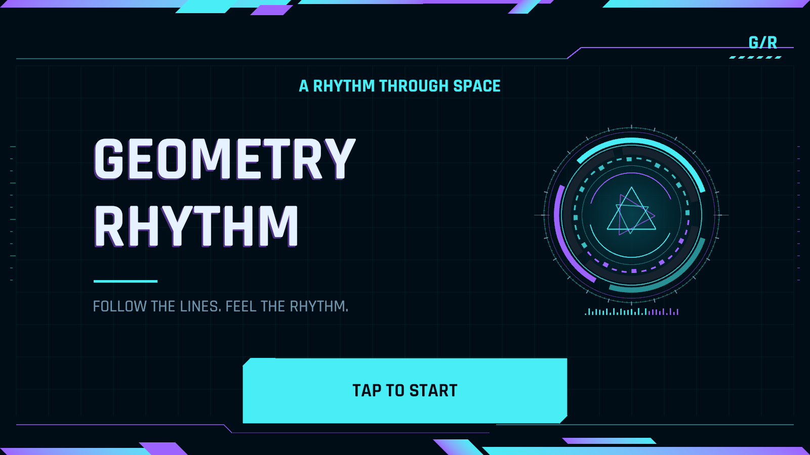
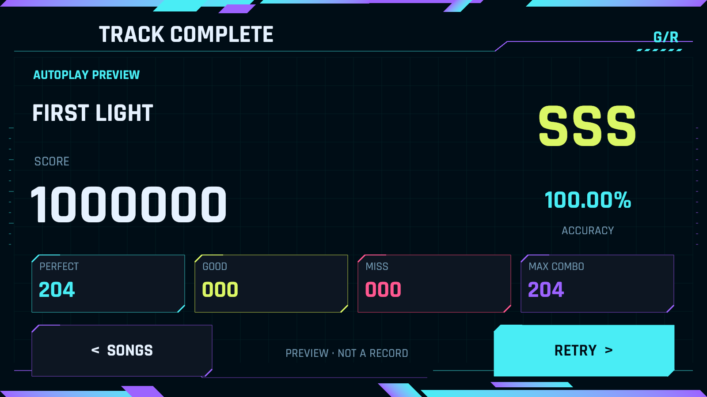
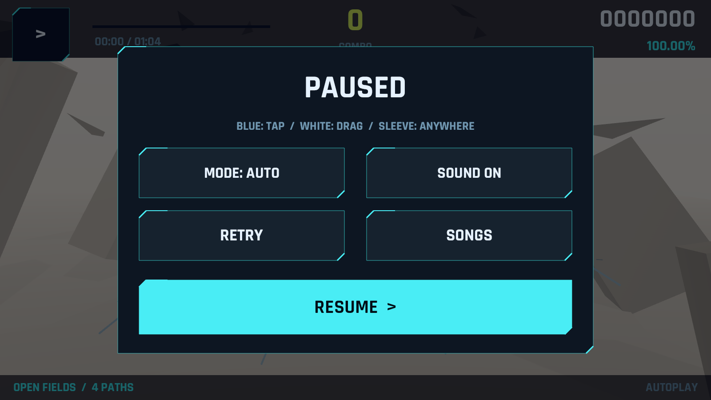

# 移动端优先的赛博朋克 UI

全部玩家界面已经作为可交互的 Unity UGUI 接入原来的 `GeometryRhythmDemo` 场景，不是图片或视频。2026-09-17 版本采用横屏手机／平板优先的触控布局、深色赛博朋克视觉；现有游玩背景、Note 皮肤、四种判定规则、JSON 格式和高帧率设置保留。

## 1. 如何运行

打开 `Assets/RhythmDemo/Scenes/GeometryRhythmDemo.unity`，等待编译后按 Play。默认先显示标题，而不是立即播放歌曲。`Builds/GeometryRhythmDemo/GeometryRhythmDemo.exe` 是用于桌面验证的播放器，不是 Android／iOS 安装包；复制时携带整个目录。

完整流程：标题 → 歌曲列表 → 手动游玩／自动演示 → 结算 → 再来一次／返回选曲。选曲页可回标题；游玩中暂停后可直接返回选曲。

| 页面 | 操作 | 结果 |
| --- | --- | --- |
| 标题 | TAP TO START | 进入选曲 |
| 选曲 | 左右滑动封面／点翻页箭头 | 切换当前曲目，更新右侧详情；不会开始游玩 |
| 选曲 | PLAY | 从头开始手动游玩 |
| 选曲 | PREVIEW | 自动演示，结算明确标记为预览 |
| 选曲 | 左上返回箭头 | 返回标题 |
| 游玩 | 左上暂停 | 打开暂停面板：恢复、重开、选曲、声音、模式 |
| 游玩 | 歌曲时间结束 | 自动结算，不再停留在旧 HUD 的 COMPLETE 提示 |
| 结算 | RETRY | 同曲、同模式重试；分数与 Combo 重置 |
| 结算 | SONGS | 返回选曲并保留所选曲目 |

玩家界面不显示键盘快捷键，也不依赖鼠标悬停。开发时仍保留 Enter／Esc、Space、R、A、M 和左右方向键等桌面调试快捷键，但它们不是移动端操作说明。切换到菜单时停止音频和谱面时间，隐藏游玩 HUD、路径、Note；深色菜单完整覆盖底层环境。开始／恢复游玩时等待菜单触点松开，防止按钮点击穿透到全屏判定 Note。

## 2. 页面与视觉

以用户提供的 Cytus II 与杂音均衡器截图为视觉方向，使用原创网格／电路边框／信号核心插画，没有复制商业游戏 Logo、角色、封面、字体或 Note 皮肤。

- 标题：深蓝黑背景、青紫渐变斜切边饰、双行 Geometry Rhythm、静态轻微色差、独立信号核心展示舱和启动按钮。
- 选曲：大封面横向分页，不使用桌面式侧栏列表；右侧显示当前曲名、作者、BPM、时长和音符数。底部主按钮开始，预览为独立次要按钮。
- 结算：大号总分区、独立荧光黄评级、青色准确率、四色判定统计卡片与再次游玩入口。
- 加载、缺失资源错误、空曲库：同一套边框、字体和状态语言，不加入虚假的百分比、网络状态或不可玩的曲目。
- 游玩 HUD：深色顶部读数、荧光黄 Combo、青色准确率与进度条。游玩时只保留暂停这一交互入口；底部只显示段落和演示状态。中间仍是原有三维舞台，没有加全屏滤镜或修改 Note。
- 暂停：半透明遮罩和切角面板，使用大尺寸恢复／重开／返回选曲／声音／模式按钮。遮罩只在暂停时接收点击；装饰网格、边框、文案不拦截游玩触点。

界面文案暂沿用 Demo 的英文风格。字体为随工程打包的 **Rajdhani Bold / Medium** 与 **Share Tech Mono**，均为 SIL OFL 1.1 开源字体，不依赖电脑安装。字体位于 `Resources/Fonts`，同目录保留完整许可证；分发包另附 `Docs/ThirdParty`。正式中文界面仍需引入覆盖中文字形的可分发字体资源。

菜单没有大面积 Bloom、模糊后处理或背景视频。装饰由 `CyberFrameGraphic`、`CyberPanelGraphic` 和 `MenuArtwork` 生成 UGUI 矢量网格，只在布局变化时重建。入场淡入为 0.18 秒；标题字的色差是静态偏移。移动版取消了封面扫描线动画，减少持续重绘。

共享主题在 `CyberTheme.cs`：深底 `Background`、分层面板 `Panel/PanelLight`，强调色 `Cyan/Purple/Lime/Pink`。优先从这里调整颜色与字体。布局数字集中在 `RhythmFrontendView`，游玩读数集中在 `DemoHud`；不要为了修改 UI 去改 `SceneVisuals` 或判定引擎。

菜单和 HUD 共用 `MobileUiLayout`，采用 1600×900 设计尺寸，在 `Screen.safeArea` 内等比容纳，响应尺寸及安全区变化。它不是渲染分辨率。非 16:9 屏幕保持控件完整，额外空间留给背景；不裁切控件，也不改变世界相机与 Note 投影。项目允许两个横屏方向，关闭竖屏自动旋转。

按钮的宽高均不小于 112 个设计单位；主按钮、返回和暂停均可直接触摸。这个数不是 Android dp／iOS pt，实际物理大小仍需真机检查。长曲名使用限定字号范围适配，不能以无限缩小文字代替布局。详细设计、测试比例和限制见 [移动 UI 验收](MobileUIVerification.md)。

## 3. 改游戏名字

场景启动对象 `Geometry Rhythm / JSON Demo` 的 `RhythmDemoController` 上提供 **Game Title**，默认两行 `GEOMETRY`、`RHYTHM`；在非 Play 状态修改并保存场景。右上角 `G/R` 是独立的临时字母标记，可在 `RhythmFrontendView.Begin` 更换。

Windows 产品名是另外一个设置，批处理构建入口 `DemoBuildTools.ValidateAndBuild` 中的 `PlayerSettings.productName` 仍为 `Geometry Rhythm Demo`，以后正式改名时同步修改即可。

`RhythmDemoController.Show Frontend` 默认开启。开发时关闭可跳过菜单直达旧的游玩 Demo；`-demoSmoke` 始终跳过菜单，用于原有玩法验证。

## 4. 新增歌曲与 JSON 约定

歌曲列表扫描 `Assets/RhythmDemo/Resources/Charts/` 中的 TextAsset JSON。每一份合法谱面就是一个可选条目，不另造与谱面不一致的假数据。当前只有真实可玩的 `Geometry / First Light`，没有虚构的其他歌曲或难度。

1. 把制谱器导出的有效 JSON 放到上述目录，文件名保持唯一。
2. 使用谱面已有的 `title`、`author` 元数据。标题含 ` / ` 时，详情主标题取最后一段，完整名称仍保留在数据中。
3. 配置 `audioResource` 指向 Resources 下的音频，不带扩展名；为空仍使用原有合成演示音乐。
4. 重新启动场景／重新构建，即可收录。运行中的列表不会监听磁盘热更新。

BPM 范围、时长、Note 数等元数据从 JSON 计算。选曲页显示 BPM、时长、Note 数；当前段落路径数留在游玩 HUD。无效 JSON 会跳过并在 Console 发出 Warning；若某个有效谱面引用了缺失音频，启动时给出可读错误并允许返回选曲。空列表也有空状态，不提供不能使用的 Play 按钮。只有一首歌时不显示翻页箭头，不用虚构曲目填充轮播。

`Chart Override` 和 `-demoChart <path>` 保留，显式指定的谱面排在首位。添加新曲时不需要修改选曲 UI、计分逻辑或 JSON schema。不同难度当前表现为不同 JSON 条目，尚未引入“歌曲—多个难度”的目录层级。

## 5. 结算的真实性

`PlayResult` 在结束时从 `JudgementEngine` 复制成绩，之后重试不会把已显示的结果改成零。显示的是本次真实判定数据，不是固定的满分样例。

- 自动演示显示 `AUTOPLAY / PREVIEW` 与“不是玩家记录”的提示。
- 用左右方向键跳转后显示 `PRACTICE SESSION`，分母使用练习区间可判定 Note 数。
- 手动全曲显示 `MANUAL PLAY`。
- 目前不写入历史成绩、最高分、排行榜或云端记录，界面明确说明尚未开启保存。
- 歌曲结束会统一处理尚未判定的末尾音符，避免谱面时间被夹到歌曲总时长后留下 Pending。

评级是当前 Demo 的展示规则：100% 为 SSS，≥99% 为 SS，≥98% 为 S，≥95% 为 A，≥90% 为 B，≥80% 为 C，其余为 D。评级不改变原有计分算法。

## 6. 代码职责

| 文件 | 职责 |
| --- | --- |
| `Runtime/RhythmFrontend.cs` | 页面状态、真实曲库、活动游玩实例、开始／返回／结算、可重复的 UI 自检 |
| `Runtime/RhythmFrontendView.cs` | 标题／选曲／结算／加载／错误／空状态，大触控按钮与入场动画 |
| `Runtime/MobileUiLayout.cs` | 菜单和 HUD 共用的安全区计算、适配与触控尺寸约定 |
| `Runtime/PagedSongCarousel.cs` | 横向拖动、单页切换、边界限制与选曲回调 |
| `Runtime/CyberTheme.cs` | 共享色板、字体加载、轻量网格绘制辅助 |
| `Runtime/CyberPanelGraphic.cs` | 切角面板及按钮底图 |
| `Runtime/CyberFrameGraphic.cs` | 渐变边饰、电路轨迹、低对比背景网格 |
| `Runtime/MenuArtwork.cs` | 原创信号核心封面插画，非游玩 Note |
| `Runtime/RhythmDemoController.cs` | 启动菜单入口、游玩会话、完成标记、菜单／游玩隔离 |
| `Runtime/DemoHud.cs` | 移动触控 HUD、判定提示、大按钮暂停面板，接口与回调保持原样 |
| `Editor/DemoValidation.cs` | 原有规则、元数据／结算快照以及安全区计算验证 |

只保持一个活动游玩实例。换曲时先停用旧实例，再销毁并创建新实例，防止双相机、双 AudioListener 或多条音乐同时播放。同曲重试复用实例与合成音轨；页面切换不重新加载整个场景。

制谱器文件与自定义舞台路径实现未在本次 UI 工作中改写，继续使用同一份 ChartData 和 SpatialDirector。

## 7. 验证与截图

批处理 `GeometryRhythm.Editor.DemoBuildTools.ValidateAndBuild` 现在包含 249 项断言，涵盖原有玩法规则、曲库元数据、评级、结算快照与三种比例的安全区计算。

玩法自检仍使用 `-demoSmoke`。UI 自检另用：

```powershell
.\GeometryRhythmDemo.exe -frontendSmoke -demoCapture "D:\Captures\UI" -screen-width 1600 -screen-height 900 -screen-fullscreen 0 -logFile "D:\Captures\ui.log"
```

自检触发实际 Button 回调和 ScrollRect 的拖动事件，检查标题、滑动选曲、开始、暂停返回、手动 Miss 结果、重试重置、自动满分预览、结算返回与标题返回，导出八张实际 Unity 渲染截图和 `frontend-smoke.txt`。还检查菜单／HUD 的 Button 尺寸。错误、空曲库、第二首歌只存在于 QA 内存，不会加入正式曲库或写入文件。换曲验证活动相机／AudioListener 唯一且成绩重置。截图使用启动时的实际屏幕尺寸并检查整页明暗对比；文字与布局另行人工视觉检查。快速自检直接推进部分判定状态，不冒充真人打完一首歌，也不等于手机系统触摸事件测试。

原版 UI 验证记录保留在 `.validation/UI-final`。前一版赛博设计记录见 [赛博 UI 验收](CyberUIVerification.md)；当前移动布局记录见 [移动 UI 验收](MobileUIVerification.md)。旧报告和旧截图保留，不代表当前布局。








当前仍是可继续迭代的 Demo：没有联网、账号、存档、排行榜、难度分组、搜索、手柄焦点导航、移动端真机字体／安全区验收。
