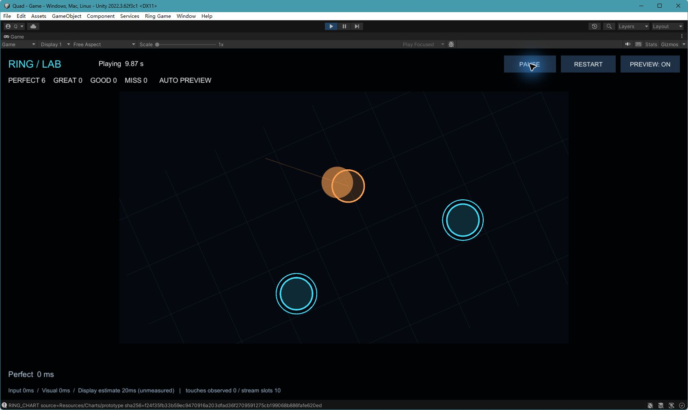

# 本次实现与执行证据

2026-10-03，Unity **2022.3.62f3c1**。本次交付游戏本体的 Android 原型、开发构建工具和供非作者复核的文档，PR 目标为 `ReStart`。独立电脑制谱器及完整特效系统仍按后续独立需求推进。

## 直接查看编辑器

用指定版本打开仓库根目录，选择 **Ring Game > Open Gameplay Preview**。菜单打开 Game 场景、放大 Game 视图并启动自动预览。画面上的青色目标使用缩圈；橙色移动圆沿轨迹到接收环；玩法层随谱面平移、旋转和缩放，HUD 固定。现有美术是便于观察几何与判定的基础原型。

右上角 PAUSE / RESUME 控制播放，RESTART 清空进度，PREVIEW 可在非游玩状态切换自动演奏。首次进入编辑器若因窗口布局切换导致 >250ms 帧间隔而显示 Interrupted，点击 RESUME。恢复有约 0.5s 预约准备时间。自动预览的 Perfect 结果只证明程序演奏路径，不证明人工点击。

以下为本机 Unity **实际 Game 视图**，歌曲约 9.87s，展示三押、移动圆、缩圈与旋转；没有合成或替换内容。编辑器目前保留打开状态，暂停后可继续播放。



## 已执行的检查

| 检查 | 实际结果 | 可复核证据 |
|---|---|---|
| 源码契约 | `python tools/check_project.py` 通过：22 个资源文件、4 个程序集、32 个唯一 GUID | 同一命令可本地/CI 重跑；不编译 C# |
| Unity EditMode | `./tools/unity.ps1 -Task Test`，**69 passed / 0 failed / 0 skipped**，Editor 正常退出码 0 | [完整 NUnit XML](Evidence/editmode-results.xml)；本机 `Builds/Validation/test-editor.log` |
| Android Development APK | ARM64 / IL2CPP，构建 Succeeded，**0 errors / 0 warnings** | [构建摘要](Evidence/android-build-summary.json)、[源码与产物指纹](Evidence/build-provenance.json) |
| APK 离线检查 | `aapt dump badging` 确认包名、debuggable、arm64-v8a、最低 API26、target API35、OpenGLES3、横屏 | 指纹记录中的 apkInspection；按下方命令重跑 |
| Windows 运行时 smoke | 同一运行时自动演奏 36s 样谱，输出 `RING_SMOKE_PASS notes=38 hit=38 miss=0`，退出码 0 | 本机 `Builds/WindowsSmoke/runtime-smoke.log`；此运行发生在最后的 HUD 清屏与编辑器入口调整之前 |
| 最终编辑器画面 | 最终源码在交互 Unity 中完成 38 Perfect / 0 Miss 的自动演奏；重新播放并保存上述截图 | 上述实际截图；覆盖窗口外黑边 HUD 残影的修复已目视核对 |

69 项测试覆盖节拍/BPM 分段、两类圆几何、判定时间边界、校准与尾窗、确定多接触匹配、严格 JSON、历史姿态反投影，以及短触点与复用 fingerId。合成六触点/十接触测试不能替代手机物理触点测试。

早期使用 Unity 原生异步 `-runTests` 的两次运行虽生成通过 XML，Editor 却在退出阶段挂起，因此没有计为命令通过。当前脚本改用同步 NUnit 入口，完整运行正常退出；未来多帧 UnityTest 需新增运行入口，当前脚本会明确拒绝。

## 本机构建产物

APK：`Builds/Android/RingGame-debug.apk`，**76,389,254 bytes**。

```text
SHA-256 a7714e718932257c517a8f8926c66eb2032d8388f67e726856da3869f0a09fff
package com.chishau.ringgame.prototype
ARM64 / IL2CPP / Development + Script Debugging
```

Unity BuildReport 的 totalBytes 是构建内容统计，不能当作压缩后的 APK 文件长度。APK 与日志留在被忽略的 `Builds/`，不纳入源码历史；更换源码后必须重建并重新记录指纹。最终 Android 构建在独立临时工程副本中执行，避免与正在供用户查看的 Editor 争用同一 Library；[指纹](Evidence/build-provenance.json)确认 Assets（含 .meta）、包锁定及 Unity 版本逐文件相同。

关闭使用此工程的 Editor 后，可按 [Android 构建文档](AndroidBuild.md) 复现：

```powershell
python ./tools/check_project.py
./tools/unity.ps1 -Task Test
./tools/unity.ps1 -Task Android
Get-FileHash ./Builds/Android/RingGame-debug.apk -Algorithm SHA256
& 'C:\Program Files\Unity\Hub\Editor\2022.3.62f3c1\Editor\Data\PlaybackEngines\AndroidPlayer\SDK\build-tools\34.0.0\aapt.exe' dump badging ./Builds/Android/RingGame-debug.apk
```

## 尚待人工核验与审核

手机此前拒绝 USB 安装，返回 `INSTALL_FAILED_USER_RESTRICTED: Install canceled by user`；没有完成应用安装、启动或实际游玩验收。用户随后要求先停止上机调试，改看 Unity，故本次保留实机核验待办。按照 [M01–M12 清单](ManualVerification.md) 记录实际手机结果，尤其 Began-only、多押、强运镜下触点定位、暂停恢复与帧停顿。

默认 20ms 显示延迟是可调估计，未测量；记录的是 CPU 提交前姿态，不是物理显示时刻。音频触控延迟、设备最大同时触点、低端机性能与不同屏幕安全区仍待人工确认。

GitHub CI 只做静态源码契约检查。PR 作者提供执行证据，非作者审核需求、代码和实机结果后决定合并；当前 `ReStart` 未启用分支保护，不能把流程文档当作 GitHub 强制门禁。此 PR 不自动合并。
