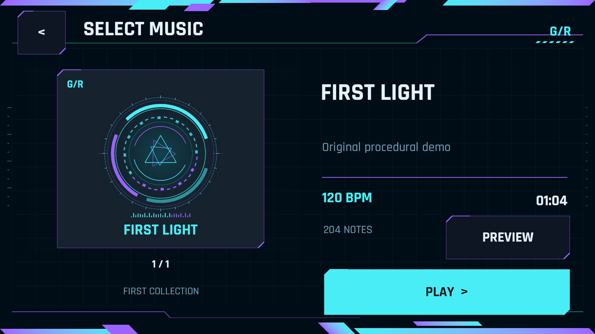
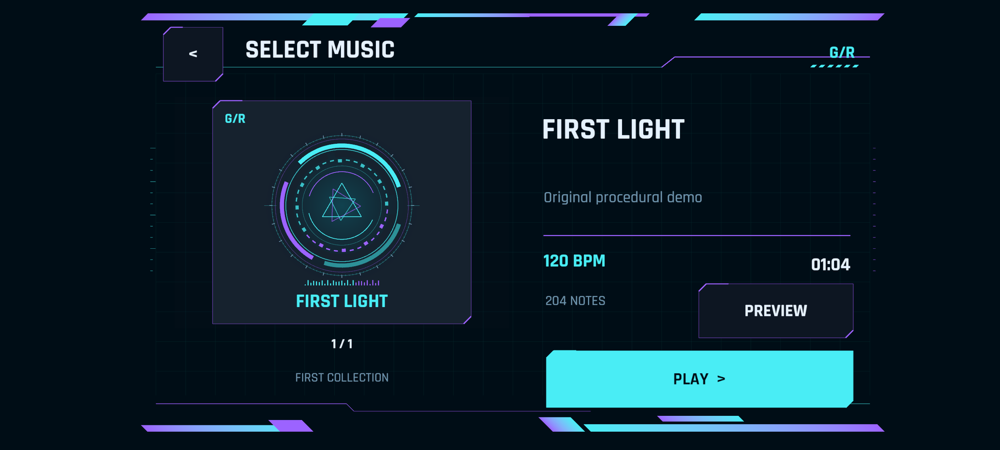
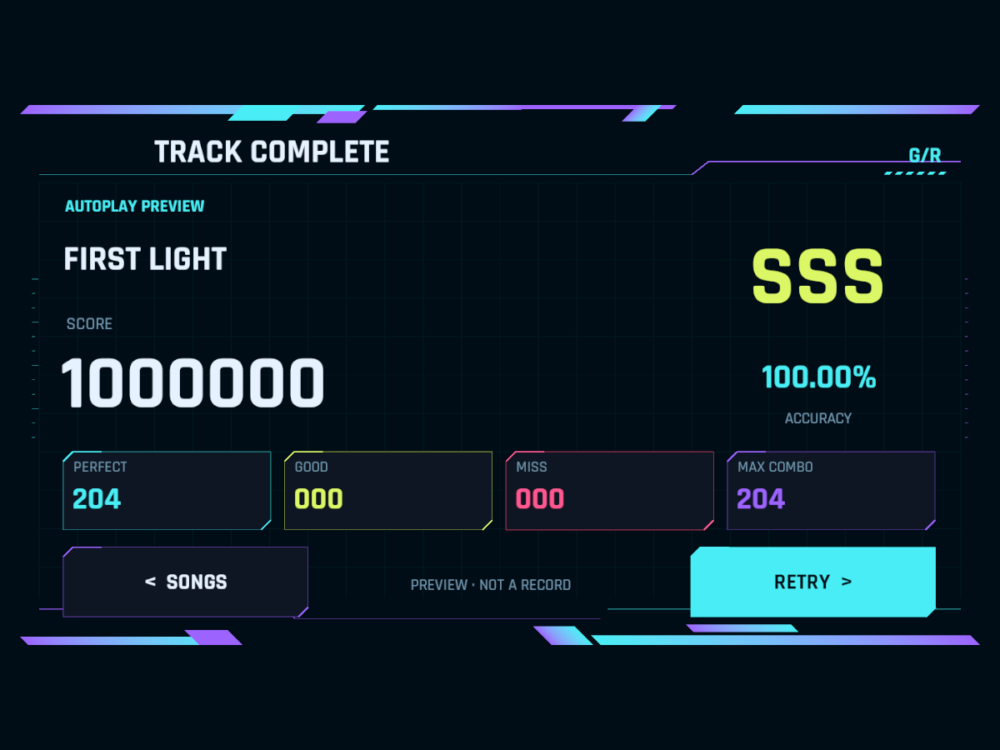
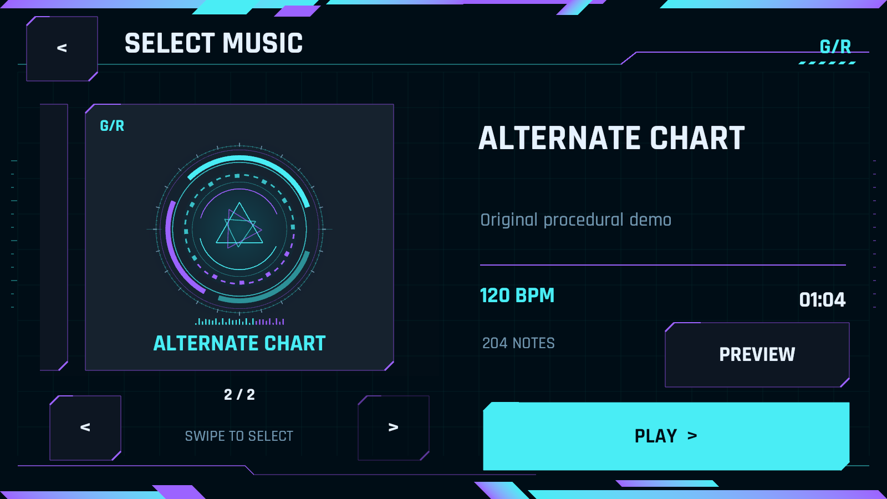

# 移动触控 UI：设计与验收

日期：2026-09-17。目标是横屏手机音游，兼容横屏平板，不按电脑软件的侧栏／工具栏方式组织玩家界面。

## 本次改动

- 标题保留 `GEOMETRY RHYTHM` 和青紫赛博边饰，核心动作只有大尺寸 `TAP TO START`。
- 选曲改成大封面左右滑动分页，右侧展示当前曲目信息，`PLAY` 为主操作。翻页不开始游戏，必须再点击开始／预览。真实曲库只有一首时隐藏翻页箭头；后续导入更多 JSON 即可使用轮播。
- 结算保留大分数／评级和四项统计，重试与返回选曲分别放在下方两侧。
- 游玩时只保留暂停按钮，减少触点误入 UI。模式、静音、重开和返回选曲收进暂停面板；暂停面板所有按钮为大触控区域。
- 去除玩家界面的键盘快捷键、小字号终端标签和装饰性状态信息。桌面快捷键仅留作开发调试。
- 新增统一安全区适配，菜单、游玩 HUD 和暂停内容都避开 `Screen.safeArea` 外的区域。全屏背景／暂停遮罩仍可覆盖整个屏幕。
- 只允许横屏两个方向，关闭竖屏自动旋转。保留现有帧率请求、MSAA 和清晰度设置。

没有修改 Note 圆环／保护套形状、蓝白颜色语义、四类判定规则、路径、3D 背景、运镜、谱面 JSON 或制谱器。

## 布局实现

`MobileUiLayout` 统一使用 1600×900 设计板，在屏幕安全区域内等比缩放、居中。安全区使用屏幕像素输入，再转换为 Canvas 单位；只有 UI 变换改变，不偏移世界相机，也不改判定投影。

所有按钮宽高至少 112 个设计单位。该值不是 dp／pt，不宣称它在所有设备上都对应相同的物理尺寸。4:3 平板上下有额外背景，20:9 手机两侧有额外背景；这是保持布局完整的选择，不是降低实际渲染分辨率。

`PagedSongCarousel` 继承 UGUI `ScrollRect`：拖动超过卡片间距的 15% 时切换一页，否则回到当前页；禁止越过首尾，松手后吸附。拖动期间 UGUI 取消按钮点击，切歌回调只更新选择和详情。当前未做长曲库虚拟化；数百首歌曲时应再加封面异步加载／可见卡片复用。

`DemoHud` 沿用原有回调接口，只更换 UI 排布。装饰与读数不拦截点击，暂停遮罩只在暂停时启用。开始／恢复时原有的触点释放保护仍保留，避免菜单点击穿透到全屏 Note。

新增和重构代码均有职责／关键行为注释。入口和 JSON 接入说明见 [前端文档](FrontendUI.md)。

## 自动化验证

使用独立 `.validation-mobile` Unity 项目副本编译，避免中断用户正在操作的主编辑器。版本为 Unity 2022.3.62f3c1，Windows Player 用于屏幕比例和交互逻辑验证；不是手机构建。

| 检查 | 结果 | 记录 |
| --- | --- | --- |
| 编译、构建、249 项断言 | 通过 | `.validation-mobile/build-v1.log` |
| 16:9，1600×900，全屏安全区 | 通过 | `.validation-mobile/Phone16x9/frontend-smoke.txt` |
| 20:9，2400×1080，安全区 x=110、y=44、w=2242、h=1004 | 通过 | `.validation-mobile/Phone20x9/frontend-smoke.txt` |
| 4:3，1200×900，安全区 x=24、y=32、w=1152、h=836 | 通过 | `.validation-mobile/Tablet4x3/frontend-smoke.txt` |
| 四种判定、真实 DSP 时钟、渲染配置、204 颗音符回归 | 通过 | `.validation-mobile/Gameplay/player-smoke.txt` |

新增 10 项断言检查三种屏幕／安全区下的边界与中心以及触控尺寸约定。原有 239 项规则／数据检查保留。三组 UI 自检均报告 `PASS=True`，实际调用按钮回调和 ScrollRect 拖动处理，覆盖标题→选曲→滑动→游玩→暂停→返回→手动结算→重试→自动结算→标题。所有被检查按钮宽高均至少 112 个设计单位。

每种比例导出标题、选曲、结算、加载、错误、空曲库、暂停与双曲轮播共八张实际 Unity 渲染截图。双曲、错误和空库只在 QA 内存中构造，不写入正式曲库。已视觉检查 16:9 全部页面、20:9 标题／选曲／暂停、4:3 选曲／结算；检查到的页面没有内容裁切或按钮重叠。

玩法回归结果：

```text
PASS=True
Images=True
FourRules=True
DspClock=True
RenderSettings=True
TargetFrameRate=-1
VSync=0
Notes=204
Score=1000000
Misses=0
```

上述 `TargetFrameRate=-1` 是 Windows 验证程序的值。移动平台仍请求当前屏幕刷新率，无有效值时回退 60；不表示已验证手机最高刷新率。日志未发现 C# 编译错误或运行时异常。

### 复现命令

在 `Builds/GeometryRhythmDemo` 目录运行：

```powershell
.\GeometryRhythmDemo.exe -frontendSmoke -demoCapture "D:\Captures\Phone20x9" -screen-width 2400 -screen-height 1080 -screen-fullscreen 0 -uiSafeInsets 110,44,48,32 -logFile "D:\Captures\phone20x9.log"
```

`-uiSafeInsets` 顺序为左、下、右、上，仅显式 UI 自检模式读取，正常玩家运行使用设备实际 `Screen.safeArea`。尺寸模拟改变的是测试播放器窗口和 UI 安全区，不是手机操作系统本身。截图通过相机空间 Canvas 离屏导出；正常玩家运行使用 Overlay Canvas。

## 实际截图

### 手机选曲（16:9）



### 宽屏手机与模拟刘海安全区（20:9）



### 平板结算（4:3）



### 多曲轮播（仅 QA 第二首）



## 验证边界与后续真机事项

- 已接入 Unity 源项目，但本次未生成 APK／AAB／iOS 工程，不能把 Windows 比例模拟称为真机通过。
- 尚需真实设备验收多指触摸、系统返回／手势冲突、旋转时的安全区更新、字体物理尺寸、手指遮挡、音频延迟与长时间发热／帧率。
- 快速 QA 推进部分判定状态；不是真人完整演奏记录，不是 CPU／GPU 性能基准。
- 当前 UI 为英文资源，中文版本需要可分发的中文字库和长文案测试。
- 自动演示明确标记为预览，不写为玩家成绩。历史存档、账号、排行榜和难度分组仍未实现。
- 检测到用户正在操作 Unity 后停止了主窗口自动点击；剩余验证在独立播放器完成，没有强制结束用户的 Play 会话。
