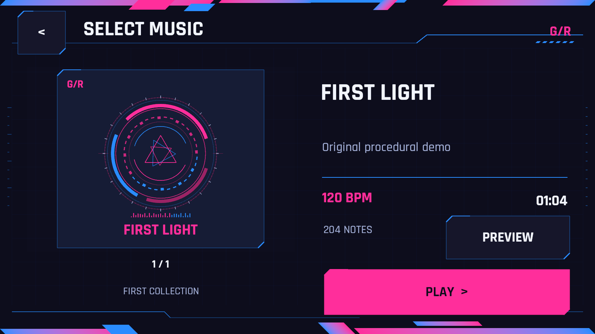

# 品红／电光蓝配色接入

本次仅修改 Unity 运行时颜色，不生成新的设计图，也不照参考图重新排列平行四边形。

- 主强调色 `Primary`：`#FF2D9B`，用于主按钮、BPM、品牌标记等。
- 次强调色 `Secondary`：`#298CFF`，用于边框、分隔线、部分圆环。
- 背景 `#0B0D1A`，面板 `#13172A`／`#191C35`，正文 `#F2F5FF`，辅助文字 `#A2AED7`。
- 上下装饰板沿用现有顶点颜色插值，渐变两端更新为品红／电光蓝。
- 按钮和圆环各段使用纯色；原封面中心青色径向渐变设为透明，不删除或移动网格。
- 判定统计中的 Good／Miss 状态色保留，Note 蓝色 Tap／白色 Drag 不受 UI 主题影响。

只修改 `CyberTheme.cs`、`CyberFrameGraphic.cs`、`MenuArtwork.cs`。为避免触碰现有 UI 布局，旧 `Cyan`／`Purple` 字段保留为 `Primary`／`Secondary` 的兼容别名。平行四边形的所有坐标、宽高、倾斜算法、翻转标记、顶点和三角形生成逻辑均未修改；13 处绘制调用的几何参数检查一致。

源项目无需更换场景。等待 Unity 导入编译后重新进入 Play，即可查看新配色。没有自动停止用户当前 Play 会话。当前菜单、HUD、暂停、结算均沿用共享主题；玩法、相机、路径与帧率设置没有修改。

## 验证

独立副本 `.validation-mobile` 编译构建通过，原有 249 项断言通过。构建日志：`.validation-mobile/palette-build.log`。桌面测试播放器位于 `.validation-mobile/PaletteBuild`，不覆盖之前交付的播放器。

前端流程验证与实际渲染截图位于 `.validation-mobile/PaletteCapture`，日志 `.validation-mobile/palette-ui.log`。这是 Unity 运行时截图，不是 AI 设计图；不等于移动端真机验收。

