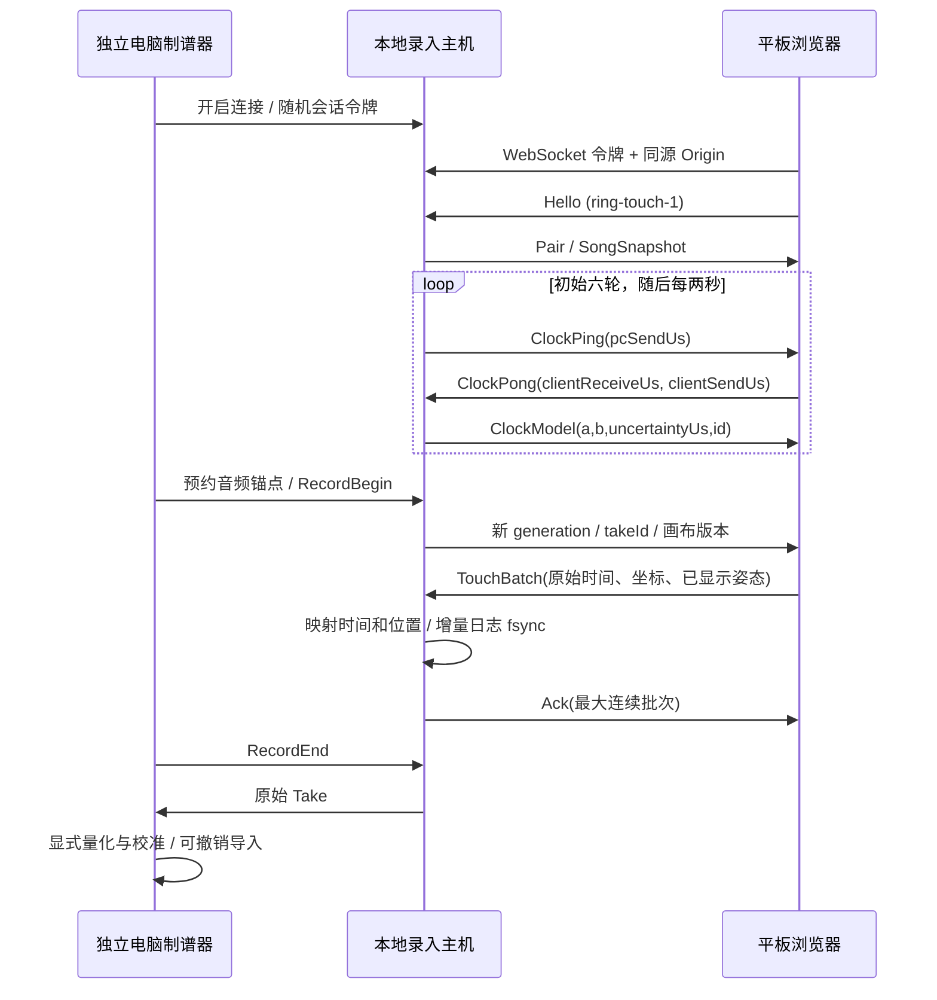

# ring-touch-1 平板实时触控录入

电脑是唯一音频主机。制谱器通过原生 IPC 提供作者命令，平板只连接独立的 HTTP/WebSocket 本地服务。网络协议与游戏谱面协议分别版本化；Unity 游戏没有引用录入服务代码。



## 连接与界限

作者开启后监听临时 TCP 端口，最多 4 个采集连接；消息最大 64 KiB、每批最多 64 个触点，这些是网络资源限制，不是 2/4 指玩法限制。每秒最多 512 条入站消息。浏览器实际每个 Began 发一个样本，各 pointerId 独立处理。

配对令牌为 24 字节随机值，放在二维码 URL 的 fragment，客户端读取后移除地址栏 fragment，并在 WebSocket 握手中使用。服务校验令牌、Origin 与 Hello 版本。HTTP 文件白名单只包含平板页面、样式、脚本及必要的制谱器预览模块，不公开工程、Take、音频或桌面 IPC。

首版使用可信局域网 HTTP/WS，未实现 TLS 或公网传输。Android 的开发 USB ADB reverse 复用同一消息协议；iPad USB 尚未实现。

## 时间映射

单位统一微秒，所有设备采集时间是单调钟，不使用 UTC。四时间戳往返样本：

```text
rttUs = (pcReceiveUs - pcSendUs) - (clientSendUs - clientReceiveUs)
clientMid = (clientReceiveUs + clientSendUs) / 2
pcMid = (pcSendUs + pcReceiveUs) / 2
pcMonoUs = a * clientMonoUs + b
songUs = anchor.songUs + pcMonoUs - anchor.pcMonoUs
```

保留最近 64 个同步样本，选最低 RTT 的 8 个。跨度超过 20 秒且有至少 4 个优质样本时拟合漂移，a 限于 ±1000 ppm；否则 a=1。不确定度由半 RTT 与拟合残差构成，不包括所有链路非对称、浏览器计时粒度、硬件触摸扫描、声卡和屏幕误差。

至少 3 轮同步后录入，超过 15 秒没有新同步则拒绝；RTT 超过 500 ms 的样本不加入模型。电脑对渲染器与主机的 IPC 单调钟做最低 RTT 桥接；Web Audio 预约播放，优先用 `getOutputTimestamp()` 估计输出时间，无法取得时记录 baseLatency 回退估计。

每个触点带采集时 `clockModelId`。主机保留对应模型，后续同步不改变已经保存的样本时间。到包时间只生成 delayedUs 和质量统计。

## 消息字段

| 类型 | 字段与含义 |
|---|---|
| Hello | protocolVersion, deviceName；设备 ID 由主机签发 |
| Pair | protocolVersion, deviceId, sessionId |
| ClockPing | seq, pcSendUs |
| ClockPong | seq, clientReceiveUs, clientSendUs；主机自行记录 pcReceiveUs |
| ClockModel | id, a, b, rttUs, uncertaintyUs, measuredPcUs, sampleCount |
| SongSnapshot | sessionId, generation, canvasVersion, chart, chartHash, transport, takeId, recording, sampleCount |
| transport | state, songUs, pcMonoUs, audioEstimate, baseLatencyMs, desktopClockUncertaintyUs |
| TouchBatch | sessionId, takeId, generation, seq, activeTouches, samples[] |
| samples[] | sampleIndex, touchId, phase=began, startMonoUs, x/y, rawX/rawY, viewport, canvasVersion, transformVersion, displaySongUs, pose, clockModelId, displayLatencyMs, pointerType |
| Ack | takeId, generation, contiguousSeq, accepted / duplicate / historical |
| Error | message；明确 CLOCK、GENERATION、SAMPLE、POSE 等错误类别 |

`x/y` 是有效 16:9 画布内归一化坐标，左下原点。像素留边不生成样本。transformVersion 是平板本轮画面递增序号，pose 与 displaySongUs 保留对应实际绘制帧。主机用冻结谱面重新求值该时刻，拒绝不一致姿态。

平板保存近 2 秒/最多 300 帧的 CPU 提交姿态，选择不晚于 `event.timeStamp − displayLatencyMs` 的帧，再用其逆相似变换得到 chartPoint。没有合适帧、画布刚缩放或时间戳异常时拒绝该次录入。这个过程是显示延迟估计，不是对物理扫描线或屏幕呈现时刻的精确观测。

## 代次、可靠性与恢复

开始、Seek、暂停/恢复、重连与谱面更新改变 generation。一次录制冻结谱面、画布版本和音频锚点。去重域为设备 ID + sessionId/takeId/generation/seq/sampleIndex，ACK 只前进到最大连续批次；平板每秒重传未确认批次，最多保留 128 批。先持久化，再确认。

正常停止保留 validStartPcUs/validEndPcUs。迟到 5 秒内、属于保留的最近 4 个 Take、位于原有效区间且带有效同步模型的样本可以回填原 Take，不混入新轮。断线结束本轮；网页重连清理旧队列，不承诺重连后自动补传。暂停、后台或断线之后需要新的录制。

原始日志是 `take-meta.json + take-journal.jsonl`，完整结束时生成 `take.json`。journal 增量追加并 fsync；重复确认不重复追加。恢复忽略崩溃截断的最后一行，保留完整前缀；完整中间行损坏会报错。Take 保留谱面与音频 SHA-256、音源名称、captured clock model、原始和映射坐标、时钟/显示估计及同步质量。跨音源导入会提示作者确认。原始资料独立于编辑撤销，量化与导入只创建音符，不改 Take。

首版把同步不确定度 >10 ms 的样本标记 review，作为人工复核提示；阈值尚未以真实平板误差实验冻结。

## 资料核对

浏览器 `event.timeStamp` 的定义与时间精度限制参见 [MDN Event.timeStamp](https://developer.mozilla.org/en-US/docs/Web/API/Event/timeStamp)。多点采集基于 [Pointer Events](https://developer.mozilla.org/en-US/docs/Web/API/Pointer_events)。音频输出估计参考 [AudioContext.getOutputTimestamp](https://developer.mozilla.org/en-US/docs/Web/API/AudioContext/getOutputTimestamp)。桌面隔离与自定义本地协议参考 [Electron Security](https://www.electronjs.org/docs/latest/tutorial/security) 和 [Electron protocol](https://www.electronjs.org/docs/latest/api/protocol)。这些 API 资料不构成本项目录入精度的实测证据。
