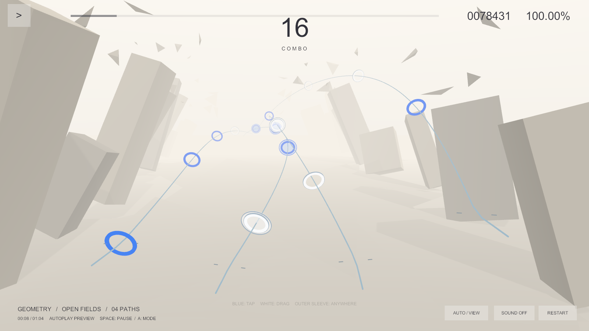
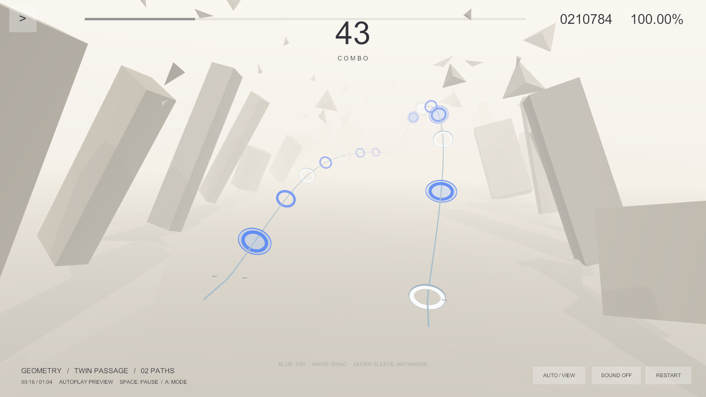
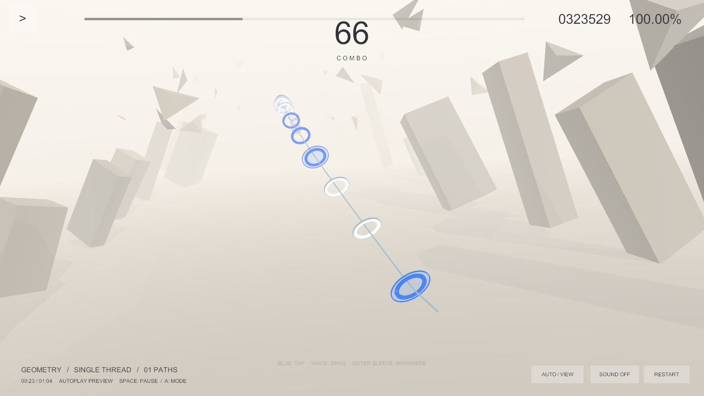
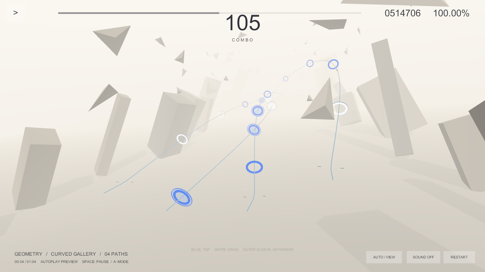
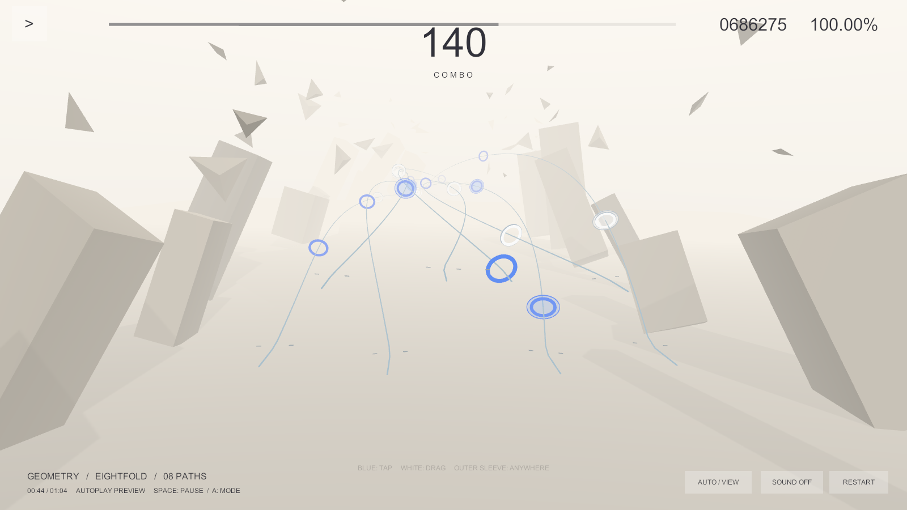
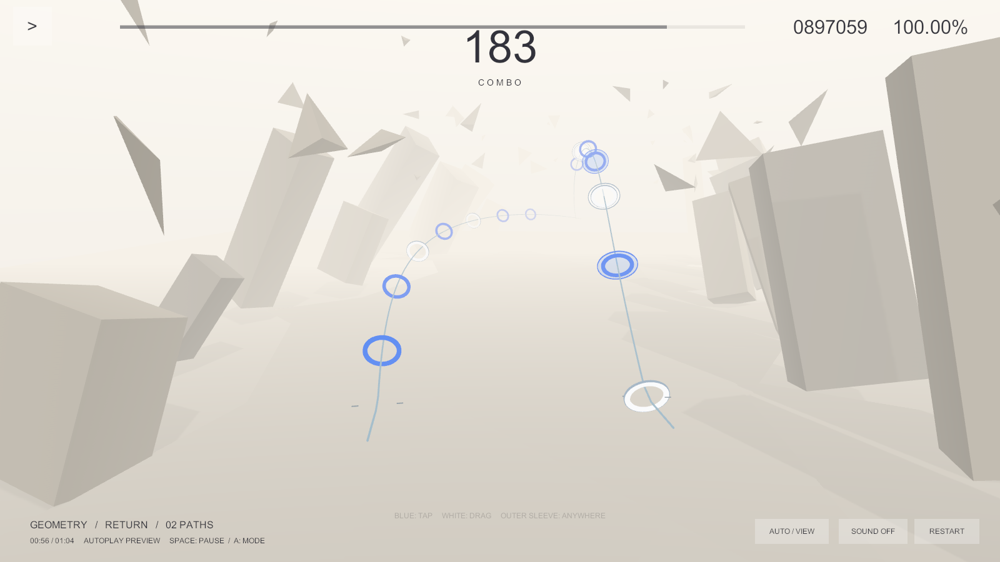

# Demo 验证记录

验证日期：2026-09-17。

## 最新：标题／选曲／结算 UI

本轮最终构建 `.validation/build-ui-v3.log` 通过 **239** 项检查（原有 233 项加 6 项曲库与结算检查）。`-frontendSmoke` 与 `-demoSmoke` 在最终 Windows 非开发版中均 PASS；前者覆盖实际 UI Button 回调、暂停返回、手动／自动结果、重试重置、跨曲切换与活动相机唯一性，后者回归四种音符、DSP 和不限帧配置。

使用 computer-use 在用户打开的 Unity 编辑器内实际点击标题进入选曲、启动自动演示，完整播放 64 秒后自动进入结算，显示 204 Perfect、0 Miss、1,000,000 分，并验证结算返回选曲。没有把自动演示成绩当作真人游玩成绩。

最终 UI 截图、操作与验证边界见 [前端 UI 说明](FrontendUI.md)。以下保留原有玩法验证记录。

## 环境

- Unity 2022.3.62f3c1，Built-in Render Pipeline。
- Windows x64 Player，Direct3D 11。初版为 Development，本次清晰度／帧率修订使用非 Development 构建。
- 实际渲染设备：NVIDIA GeForce RTX 5060 Laptop GPU。
- 截图分辨率：1600×900。
- 在 `.validation` 独立项目副本中编译和构建，避免关闭或修改用户打开的编辑器场景。

## 验证结果

最终构建成功。Unity 内运行的 233 项断言全部通过，包括 29 项基础规则／数据／空间检查与 204 颗 Note 的判定时刻屏幕范围检查。

规则检查覆盖：

- BPM 变化与反向时间换算。
- 普通 Tap 拒绝错误位置、保护套 Tap 接受任意游戏区域位置。
- Tap 时间窗口、一次输入一次消费、普通 Tap 优先、重复判定保护。
- 普通 Drag 需要持续接触和位置重叠，保护套 Drag 仅需持续接触。
- 提前接触的 Drag 不能在目标时间之前直接得分。
- Good 权重、Miss 和 Combo 清零。
- 跳转跳过旧 Note、练习分母、自动演示一次跨过多个事件。
- 1／2／4／8 路径变化、Note 到达位置等于判定位置。
- 空间求值与调用历史无关。
- 倾斜圆盘投影、错误位置、镜头后方目标拒绝。
- 非法格式版本和未知 action 被拒绝。

独立播放器另行通过：

```text
PASS=True
Images=True
FourRules=True
DspClock=True
RenderSettings=True
TargetFrameRate=-1
VSync=0
Notes=204
Score=1000000
Misses=0
```

`FourRules` 使用实际生成的 Note GameObject、相机投影与判定引擎验证四类音符。`DspClock` 验证真实 DSP 时间前进与暂停后冻结。整谱自动判定结果为 204 颗、满分 1,000,000、0 Miss。

### 清晰度／帧率修订复测

- 实际 Unity Game 菜单发现 Low Resolution Aspect Ratios 被勾选，Free Aspect 预览显示 1.5x。已取消该选项，选择 Full HD (1920×1080)，最大化预览时显示 1x；Stats 确认 Screen 为 1920×1080。Game view only 的 VSync 也为关闭。
- 新构建再次通过 233 项检查，日志为 `.validation/build-v4.log`。
- 独立播放器自检输出位于 `.validation/Captures-v4/player-smoke.txt`，日志为 `.validation/player-v4.log`；自检以 1920×1080 窗口启动，离屏 QA 图片仍固定 1600×900。
- 新增 `RenderSettings` 断言：桌面 targetFrameRate = -1、vSyncCount = 0、每帧渲染、4× MSAA、相机允许 MSAA 且动态分辨率关闭。该断言验证设置，不是帧率基准测试，也不保证具体硬件持续达到某个 FPS。
- 刷新并重新编译用户打开的编辑器后，1080p Game 视图的 Stats 曾显示 416.3 FPS。这只是场景开始阶段的一次即时读数，不是全曲平均值或最低帧率。

最终播放器检查日志未发现运行时 Exception 或 Shader error。首次检查发现的 MaterialPropertyBlock 初始化时机错误已修复：移到主线程 Start 初始化流程。

## 真实运行截图

以下图片由 Windows Unity Player 的实际相机、三维场景和 UGUI 渲染到离屏 RenderTexture 后导出，包含真实自动演示前缀的成绩，不是重新生成的设计稿。

### 四路径，8 秒



### 双路径，16 秒



### 单路径，23 秒



### 曲线运镜，34 秒



### 八路径，44 秒



### 返回段，56 秒



## 验证边界

- 屏幕范围检查针对每颗 Note 的目标判定时刻，不等于完整的遮挡、可见时长或手部遮挡分析。
- 四种规则已经在独立播放器中程序化触发验证；没有将此描述为真人完成整首谱面。
- 未执行移动端真机多指、音频输出延迟、长时间发热与帧率稳定性测试。
- 截图模式暂停在指定时间，并为隐藏窗口采用相机空间 Canvas；正常游玩使用屏幕空间 Overlay Canvas。
- 当前 QA 验证的是 Demo 的功能与画面，不代表它已经达到正式发行标准。

复现入口与 JSON 格式见 [完整说明](GeometryRhythmDemo.md)。

## 赛博朋克 UI 更新（2026-09-17）

标题、选曲、结算、加载、异常／空状态、游玩 HUD 与暂停控制台已经统一重设计。新版本再次通过 239 项断言、独立播放器 UI 流程及四类音符／DSP／渲染配置回归。八个玩法核心文件的 SHA-256 与改 UI 前完全相同。详细日志、实际截图和验证边界见 [赛博 UI 验收记录](CyberUIVerification.md)。以上旧截图保留用于记录原始玩法；新版 HUD 截图见新报告。
