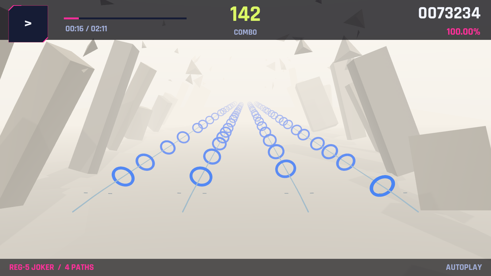
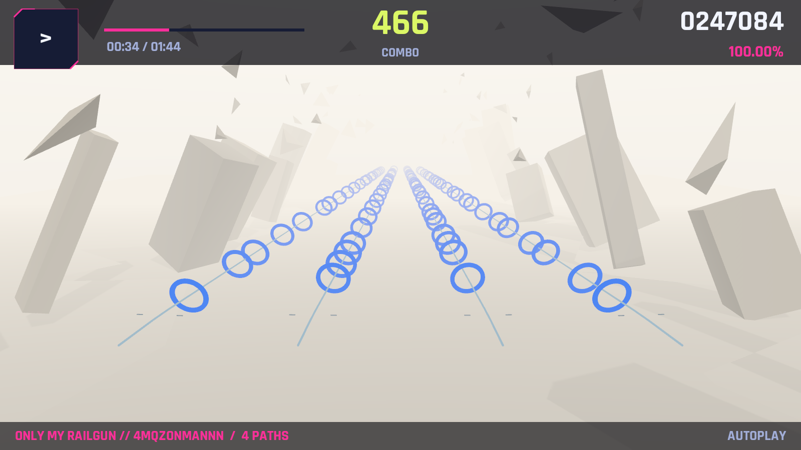
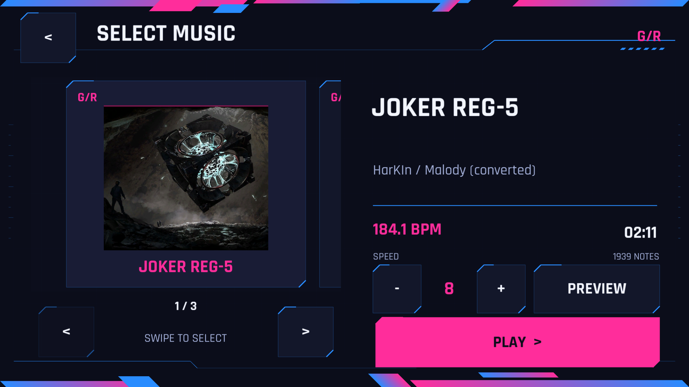
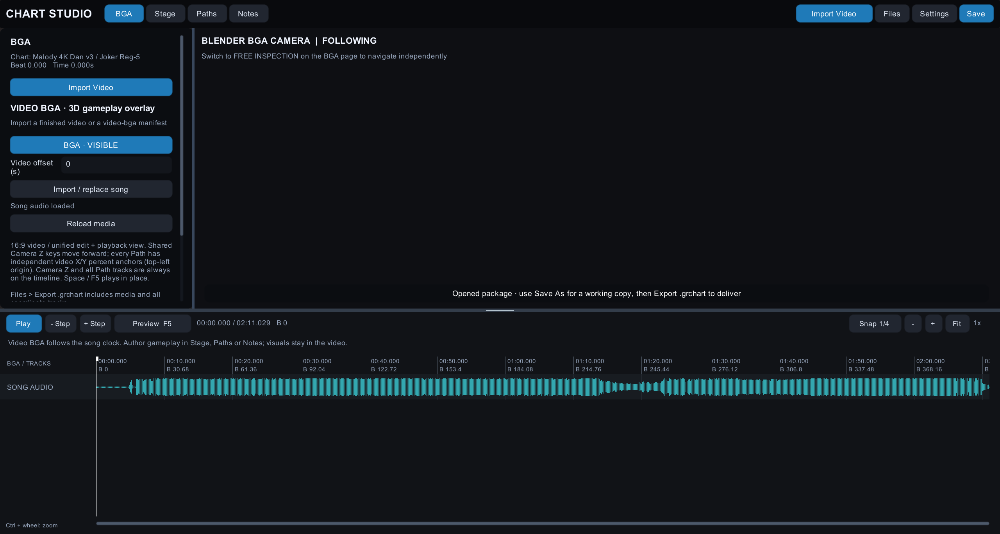

# 4 轨谱面导入（osu!mania / Malody）

## 2026-09-27 四轨间距收紧

三张已导入谱面（Joker、only my railgun、Koi Kou Enishi）的横向坐标从
`-11 / -4 / 4 / 11` 调整为 `-8.8 / -3.2 / 3.2 / 8.8`，整体居中，间距缩小 20%。
游戏 JSON、便携 `.grchart` 和转换器默认值已同步。现有谱面只改 `placements[].x`，
逐字段核对音符、BPM、偏移、机位等均保持原值；包内音乐、曲绘与元数据逐字节一致。
验证记录：`Logs/compact-four-lanes-verification.json`。流速和出现位置仍由个人设置控制。

安卓非开发包 `Builds/AndroidCompactLanes/GeometryRhythmDemo.apk` 已安装到调试平板。
原有 257 项规则、110 项触摸、10204 项谱面导入、254 项出现位置检查全部通过；
三组音乐偏移的转换器端到端用例通过。实机确认 Koi Kou Enishi 的四个判定环居中收紧，
互不重叠，见 `Docs/Screenshots/android-compact-lanes.png`。

## 2026-09-27 新增：Koi Kou Enishi / Reg-3

用户提供的 Malody `Various Artists - Malody 4K Regular Dan v3-Jack (3dan).mc` 已转换为
`Malody 4K Reg-3 / Koi Kou Enishi`，谱师 DongShaoZhou。144 BPM，103.33 秒，
1055 个音符（1045 Tap、10 Drag），四列分别 268 / 262 / 265 / 260 个，无重复音符被丢弃。
原谱 10 个长条沿用已有转换规则：在起始时刻判定为 Drag，不保留长按时长判定。

第 0 拍音乐事件包含 `offset: 370`。旧转换器错误地忽略所有 Malody 音乐偏移；
现在写入本游戏的 `audioOffsetSeconds: -0.370`，即音乐在谱面开始后 370 ms 播放。
偏移符号交叉核对了 [malody2osu 的转换实现](https://github.com/Jakads/malody2osu/blob/master/convert.py#L123-L134)，
并通过正偏移、负偏移、零偏移的游戏 JSON / 便携包端到端测试。
本次未重新生成其他已导入谱面。768 分拍到 480 ticks/beat 的最大量化误差为 0.326 ms。

产物：

- `Assets/RhythmDemo/Resources/Charts/koi-kou-enishi-reg3-4k.json`
- `Assets/RhythmDemo/Resources/Audio/koi-kou-enishi-reg3-4k.ogg`
- `Assets/RhythmDemo/Resources/Covers/koi-kou-enishi-reg3-4k.jpg`
- `Charts/koi-kou-enishi-reg3-4k.grchart`（内含完整音频与封面）
- `Charts/Sources/koi-kou-enishi-reg3-4k.mc`（原谱副本）

源 OGG、JPG 与资源文件、便携包内文件逐字节一致；封面导入保留原图比例。
验证结果保存在 `Logs/koi-import-verification.json`。
Android 构建新增真实曲库加载校验：257 项规则、110 项触摸回归，以及四张谱面共 10204 项
加载、音频、封面、全谱自动判定和屏幕投影检查均通过。
最终 Android 输出为 `Builds/AndroidKoiImport/GeometryRhythmDemo.apk`。
已覆盖安装到调试平板并实测曲库第 3/4 首、真实封面、游戏自动演示。
15 秒 SurfaceFlinger 采样取得 2138 帧，平均 **143.59 FPS**，p95 6.95 ms，
最长帧间隔 13.90 ms，无超过 25 ms 的帧；见 `Logs/android/fps-koi-import-final.json`。
APK 为非开发包，已移除上一轮临时触摸日志，v2 签名验证通过；大小 33,115,233 字节，
SHA-256 `18E9B39885DC300BD52C02EEBAC415EE021C93A60E1E8FC28AA5777EE60F6F11`。
实机截图：`Docs/Screenshots/android-koi-songs.png`、`Docs/Screenshots/android-koi-playing.png`。

```powershell
python BGA/tools/import_vsrg_chart.py `
  --input Charts/Sources/koi-kou-enishi-reg3-4k.mc `
  --audio Assets/RhythmDemo/Resources/Audio/koi-kou-enishi-reg3-4k.ogg `
  --cover Assets/RhythmDemo/Resources/Covers/koi-kou-enishi-reg3-4k.jpg `
  --slug koi-kou-enishi-reg3-4k `
  --title "Malody 4K Reg-3 / Koi Kou Enishi" `
  --author "DongShaoZhou / Malody (converted)"
python -m unittest discover -s BGA/tools -p test_import_vsrg_chart.py
```

本页记录把外部 4 键谱面转成 **Geometry Rhythm 谱面**并导入游戏与制谱器的一次完整导入。
转换脚本是仓库内的 `BGA/tools/import_vsrg_chart.py`，可重复运行：源谱面放在
`Charts/Sources/`，音频与谱面由脚本写进游戏资源目录，便携包写进 `Charts/`。

## 本次导入的两张谱面

| 歌曲 | 来源 | 键数 | 音符 | 长条 | BPM | 时长 | 音频 |
| --- | --- | --- | --- | --- | --- | --- | --- |
| Malody 4K Dan v3 / Joker Reg-5 | `Charts/Sources/joker-reg5-4k.mc`（Malody，谱师 HarKIn） | 4 | 1939（1918 tap + 21 drag） | 21 个 endbeat | 184.081751 | 131.03 s | `DJNero - Joker.ogg`（132.21 s） |
| Jack House's 140 Jack Practice v2 / only my railgun | `Charts/Sources/only-my-railgun-jack-4k.osu`（osu!mania，谱师 yks1） | 4 | 1886（1871 tap + 15 drag） | 15 个 hold | 143.000 | 104.90 s | `only my railgun.ogg`（104.49 s） |

两列分布都在四轨之间均匀铺开（Joker 477 / 507 / 493 / 462，railgun 458 / 473 / 472 / 483），
没有出现某一列被整段空置的转换错误。同一 tick 同一轨的重复物体会被丢弃，两张谱面都是 0 个。

## 场景：静态机位 + 4 条直线轨道

导入的谱面不依赖任何视频或 BGA，也不需要运镜。整首歌共用 **一个机位**：

* `stagePath` 是一条直线：`(0,0,0) → (0,0,905.1)`（Joker）/ `(0,0,774.5)`（railgun），
  `unitsPerSecond = 5`。直线保证相机在整首歌里既不拐弯也不摇摆；长度按
  `时长 × 5 + FarDepth(100) + 余量` 计算，`ChartLoader` 的“舞台路线太短”检查因此不会触发。
* `cameraKeys` 只有 beat 0 与 endBeat 两个**数值完全相同**的关键帧：
  `orbit 0 · roll 0 · distance 30 · height 6 · fov 54 · easing linear`。两个关键帧相同，
  所以时间轴上有完整的机位轨，但画面构图从头到尾不变。
* `sections` 只有一段（名字取源谱难度名），
  `placements` 为 `p0..p3`，`x = -8.8 / -3.2 / 3.2 / 8.8`，`y = 0`，`bend = 0`，`lift = 0`：
  四条**笔直**的世界空间轨道，判定线落在屏幕高度约 30% 处，四条轨道在屏幕宽度
  约 26% / 41% / 59% / 74% 的位置（16:9 机位），远处收束到同一个灭点。

判定规则、Note 皮肤、流速与音频偏移都沿用引擎原有机制（`approachSeconds = 3.4`，
无视频谱面的固定世界坐标运动），没有为本次导入改动任何运行时代码。

## 转换映射

| 源数据 | 目标字段 | 规则 |
| --- | --- | --- |
| Malody `beat: [a,b,c]` | `tick` | `beat = a + b/c`，`tick = round(beat × 480)` |
| Malody `endbeat` | `action` | 存在且大于起始 beat → `drag`（引擎没有长按判定），否则 `tap` |
| Malody `column` | `pathId` | `p0..p3` |
| Malody `time[].bpm` | `tempos` | `tick = round(beat × 480)`，首段强制落在 tick 0 |
| Malody 音乐事件 `type: 1` 的 `offset` | `audioOffsetSeconds` | 第 0 拍的单音轨音乐事件：`−offset / 1000`；多个音乐事件或非零起始拍会明确报错 |
| osu `[TimingPoints]` 非继承点 | `tempos` | `bpm = 60000 / beatLength`，继承点（SV）忽略 |
| osu 拍号原点 | `audioOffsetSeconds` | 第一个非继承点的 offset ÷ 1000（本谱为 −0.303 s） |
| osu `HitObjects` type 128 | `action` | `drag` |
| osu `HitObjects` 其余圆形 | `action` | `tap` |
| osu `x`（0–511） | `pathId` | `floor(x / 128)`，限制在 `p0..p3` |
| 最后一个物件的 beat | `endBeat` | `ceil(最后 beat) + 4` 拍，保证尾判与结算不被截断 |
| `--cover <图片>`（可选） | `coverResource` | 复制到 `Resources/Covers/<slug>.jpg`，选曲界面显示真实曲绘；不传则保留原创矢量封面 |

音符 `protectedNote` 一律为 `false`（普通 Note，需要打在音符本体上）。
路径 `id` 固定为 `p0..p3`，音符 `id` 为 `n000001` 起的连续编号。

## 产物

| 路径 | 用途 |
| --- | --- |
| `Assets/RhythmDemo/Resources/Charts/joker-reg5-4k.json` | 游戏谱面（`audioResource = Audio/joker-reg5-4k`） |
| `Assets/RhythmDemo/Resources/Charts/only-my-railgun-jack-4k.json` | 游戏谱面（`audioResource = Audio/only-my-railgun-jack-4k`） |
| `Assets/RhythmDemo/Resources/Audio/joker-reg5-4k.ogg` | 游戏内音频 |
| `Assets/RhythmDemo/Resources/Audio/only-my-railgun-jack-4k.ogg` | 游戏内音频 |
| `Assets/RhythmDemo/Resources/Covers/*.jpg` | 选曲界面曲绘（`coverResource = Covers/<slug>`） |
| `Charts/joker-reg5-4k.grchart` | 制谱器便携包（`package.json` + `chart.json` + `chart.assets/Audio|Covers/…`） |
| `Charts/only-my-railgun-jack-4k.grchart` | 制谱器便携包 |

两个 `.grchart` 都是自包含 ZIP，制谱器里用 **Files → Open chart / package** 直接打开，
音频随之解包（`audioFile = chart.assets/Audio/<slug>.ogg`）；`Ctrl+S` 保存的是工作副本，
导出仍走 **Files → Export .grchart package**。游戏侧的谱面走 `Resources`，
`audioResource` 由 `RhythmDemoController` 用 `Resources.Load<AudioClip>` 读取，
两首歌因此直接出现在选曲列表里。

## 重新运行

```powershell
# 1. 转换（源谱面 → 游戏谱面 + 音频 + .grchart）
python BGA/tools/import_vsrg_chart.py `
  --input Charts/Sources/joker-reg5-4k.mc `
  --audio "D:\Charts\DJNero - Joker.ogg" `
  --slug joker-reg5-4k `
  --title "Malody 4K Dan v3 / Joker Reg-5" `
  --author "HarKIn / Malody (converted)"

python BGA/tools/import_vsrg_chart.py `
  --input Charts/Sources/only-my-railgun-jack-4k.osu `
  --audio "D:\Charts\only my railgun.ogg" `
  --slug only-my-railgun-jack-4k `
  --title "Jack House's 140 Jack Practice v2 / only my railgun" `
  --author "yks1 / osu!mania (converted)"

# 2. 谱面导入校验（解析 + 自动判定 + 音频存在 + 打击点屏幕范围）
& "C:\Program Files\Unity\Hub\Editor\2022.3.62f3c1\Editor\Unity.exe" `
  -batchmode -nographics -projectPath $PWD `
  -executeMethod GeometryRhythm.Editor.ChartImportValidation.RunBatch `
  -quit -logFile Logs/chart-import-validation.log
```

`--dry-run` 只解析与校验、不写文件，适合先确认源谱面能读。
脚本在写出前会按 `ChartLoader.Parse` 的规则自查一遍（版本、节拍、tempo 顺序、
路径/段落引用、相机关键字范围、舞台路线长度等），任何一条不过就直接失败，
不会写出一个会从选曲列表里静默消失的谱面。

## 验证

`ChartImportValidation` 对 `Resources/Charts` 里的**每一张**谱面重跑真实加载器：

```text
Chart import OK: geometry-demo · Geometry / First Light · 204 notes · 120 BPM · 64.00 s · 8 paths · no audio
Chart import OK: joker-reg5-4k · Malody 4K Dan v3 / Joker Reg-5 · 1939 notes · 184.1 BPM · 131.03 s · 4 paths · Audio/joker-reg5-4k
Chart import OK: only-my-railgun-jack-4k · Jack House's 140 Jack Practice v2 / only my railgun · 1886 notes · 143 BPM · 104.90 s · 4 paths · Audio/only-my-railgun-jack-4k
GEOMETRY_CHART_IMPORT_PASS 4047 checks over 3 charts
```

覆盖范围：结构解析、音符 ID/路径/段落引用、`endBeat` 之后的音符、音频资源存在、
整谱自动判定（音符全部命中、0 Miss、满分）、每颗音符在**自己的判定时刻**落在播放区域内的
屏幕范围检查（校验相机 1600×900，16:9 投影），以及选曲条目元数据（标题、BPM、时长、轨数）。

### 独立播放器实测

构建 `Builds/VsrgImport`（`GEOMETRY_VALIDATION_PASS 249 checks` + `GEOMETRY_BUILD_SUCCESS`），
再用 `-demoSmoke -demoChart <谱面>` 在真实 Windows 播放器里跑：

```text
# Joker（1939 颗）
PASS=True  Images=True  FourRules=True  NoteKinds=2  DspClock=True  RenderSettings=True
Notes=1939  Score=1000000  Misses=0

# only my railgun（1886 颗）
PASS=True  Images=True  FourRules=True  NoteKinds=2  DspClock=True  RenderSettings=True
Notes=1886  Score=1000000  Misses=0

# 原有几何 Demo 回归（204 颗）
PASS=True  FourRules=True  NoteKinds=4  Notes=204  Score=1000000  Misses=0
```

下面两张是播放器真实相机、真实场景渲染出来的画面，成绩前缀来自该谱面的自动演示：





选曲列表（`-frontendSmoke -demoChart`，两首歌都在曲库里，含真实曲绘与流速模块）：



### 前端流程实测

`-frontendSmoke -demoChart <谱面>` 把该谱面当作曲库第一首，用真实 Button 回调走完整流程
（标题 → 选曲 → 自动演示 → 暂停 → 返回 → 手动 → 结算 → 重试 → 自动 → 返回）：

```text
# Joker
PASS=True  Songs=3  AutoScore=1000000
init True page=Title songs=3
song list speed 8 -> 8
pause sheet speed 8 -> 8
autoplay score=1000000 perfect=1939 expected=1939
carousel qa=True back=True selected=0 bundled=3 songs=4
alternate ok=True selectedQa=True page=Playing title=QA / Alternate chart expected=QA / Alternate chart
return ok=True page=Playing title=Malody 4K Dan v3 / Joker Reg-5 expected=Malody 4K Dan v3 / Joker Reg-5 judged=0 cameras=1

# only my railgun
PASS=True  Songs=3  AutoScore=1000000（1886/1886，选曲页与暂停面板的流速按钮同样通过）

# 曲库自带谱面回归
PASS=True  Songs=3  AutoScore=1000000（204/204，Geometry / First Light）
```

### 制谱器打开包

`Charts/*.grchart` 用现成的 Chart Studio 分别启动
（`GeometryChartStudio.exe -chart <包> -chartEditorSmoke -chartEditorCapture <目录>`），
两个包都写出：

```text
PASS=True
StagePoints=2        # 直线舞台路线
Paths=4              # 四条轨道
Screenshot=…/chart-studio.png
```

制谱器状态栏显示 **Opened package · use Save As for a working copy, then Export .grchart**
与 **Song audio loaded**，时间轴画出真实歌曲波形（时长 02:11.029），说明包内的
`chart.assets/Audio/*.ogg` 也被正确解出并解码。



## 顺带修好的三处自检代码

曲库从 1 首变成 3 首、谱面从“四种音符齐全”变成“只有 tap/drag”之后，暴露了三个问题。
判定、时钟、空间求值这些玩法核心没有改动；前两条只影响自检，第三条是真实缺陷：

* `-demoSmoke` 会为四种音符各取一颗样例；转换谱面没有保护套音符时 `Array.Find` 返回
  `null`，协程抛 `NullReferenceException` 后播放器不再退出（进程挂住）。现在跳过不存在的
  音符类型，并在报告里写出真正验证到的类型数 `NoteKinds=`。
* `-frontendSmoke` 假设“一次滑动就能滑到追加的 QA 条目”，曲库变大后不再成立。现在按实际
  卡片数逐张滑动，并把每一步的判定值写进 `frontend-smoke.txt` 的 `Trace:` 段（原先只看得到
  一个裸 `PASS=False`）。
* `-demoChart <文件>` 会覆盖**每个** session 的谱面：前端切歌后播放的仍是命令行那张谱。
  自检里“追加一个 QA 条目并播放它”因此永远播到旧谱面。现在 session 优先使用自己拿到的
  谱面（前端每首歌各自赋值），命令行文件只在没有指定谱面的普通 Demo 场景里兜底——
  场景里的 `chartOverride` 本来就是空的，所以 `-demoChart` 的原有用法不受影响。

## 已知边界

* 引擎没有长按判定，长条只保留**头部判定**并改成 `drag`（需要按住并保持在音符上），
  长条长度、尾部判定和长条期间的手感都不等价于源谱面。
* 拍号统一量化到 480 tick/拍：Malody 的 1/768 拍与 osu 的毫秒时间会四舍五入到
  0.65 ms 以内，不影响 40 ms 的 Perfect 窗口，但不是逐位无损。
* 谱面在当前版本的固定 4 轨布局上播放；源谱面的列宽、皮肤、SV 变速与故事板不导入。
* 谱面在最后一个音符之后 4 拍结束，音频末尾多出的部分不会播完（Joker 音频比谱面长 1.2 s，
  railgun 谱面比音频长 0.4 s）。
* 两张谱面都没有 `videoSpace`，所以游戏里的**流速**设置通过缩放它们自己的 `approachSeconds`
  阅读窗口生效（推荐 8× 正好等于谱面写入的窗口，见 [制谱器说明](GeometryChartStudio.md)）；
  判定时刻、判定位置与谱面文件都不受影响。
